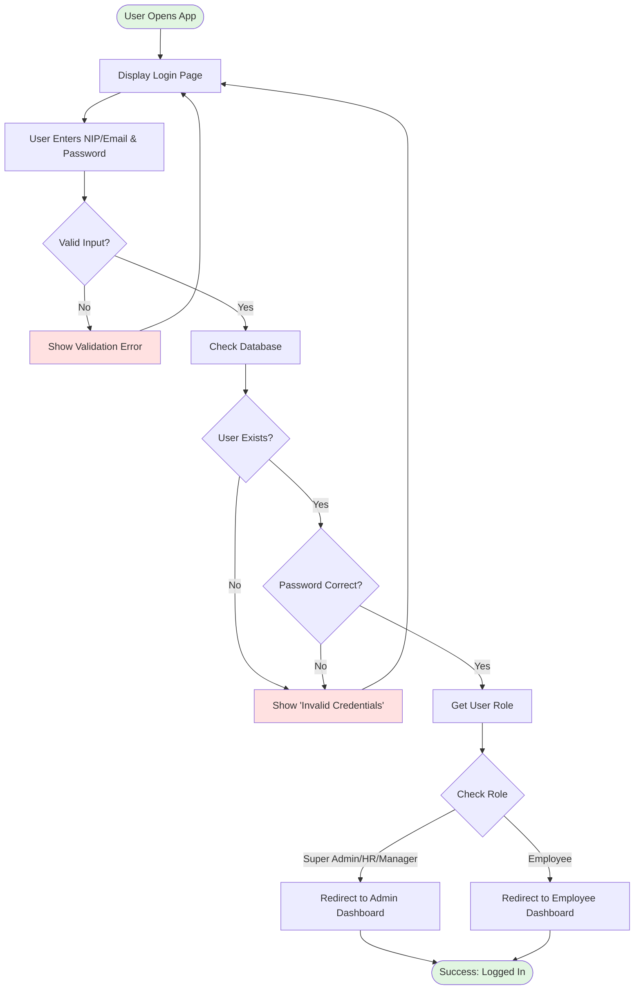
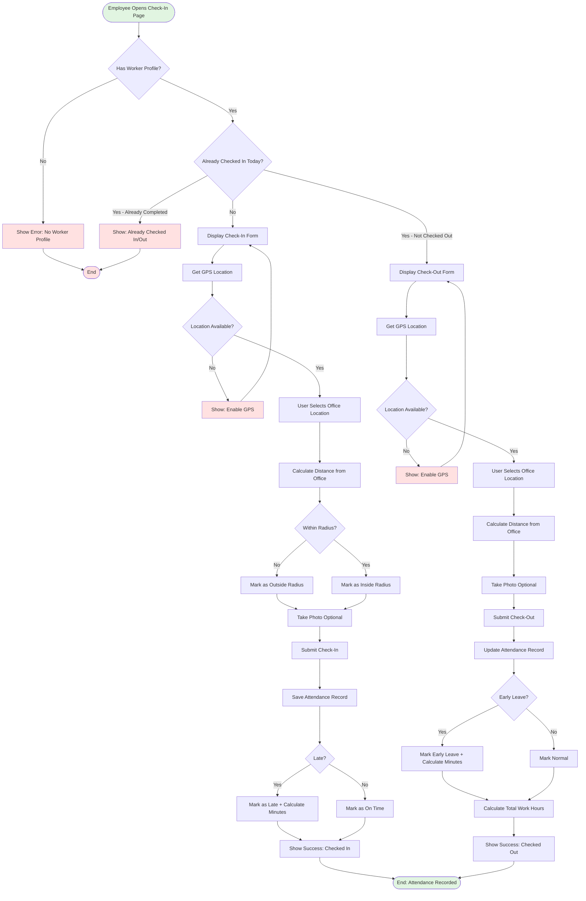
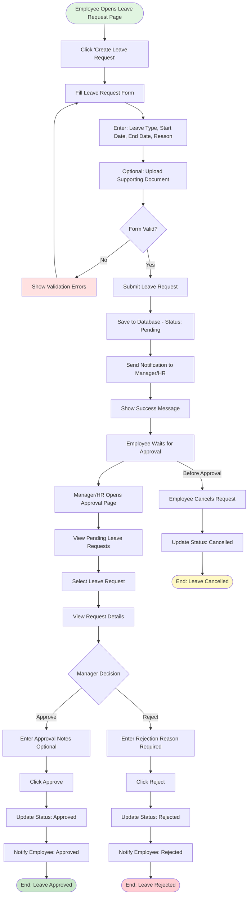
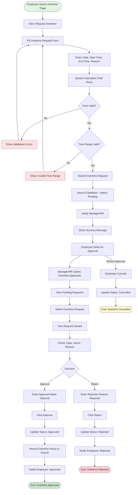
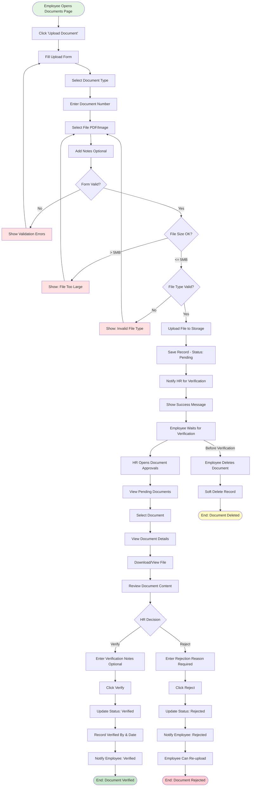
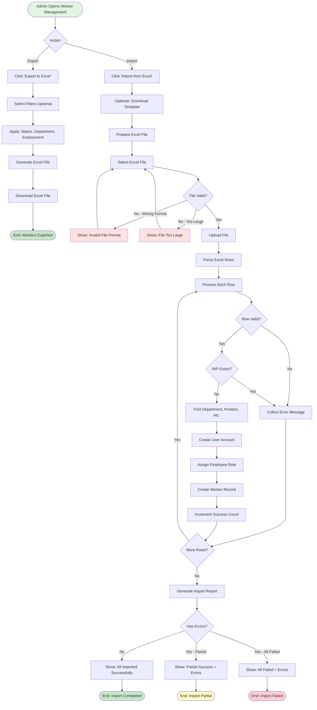
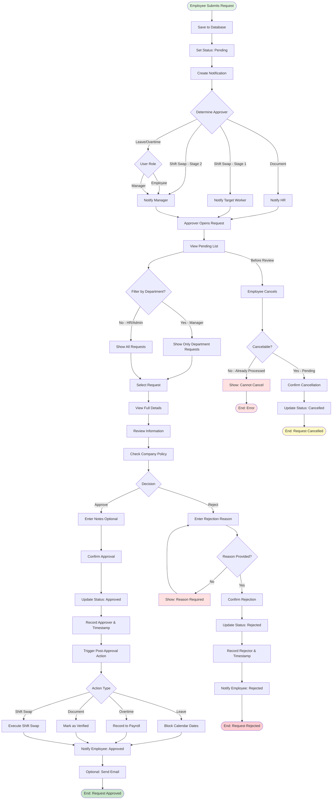

# 📊 Activity Diagrams - SIMPEGRS RSUD Haji Darlan Ismail

**Project:** Sistem Informasi Manajemen Pegawai Rumah Sakit  
**Version:** 1.0.0  
**Last Updated:** January 3, 2026

---

## 📋 Table of Contents

1. [Authentication Flow](#1-authentication-flow)
2. [Check-In/Check-Out Flow](#2-check-incheck-out-flow)
3. [Leave Request Flow](#3-leave-request-flow)
4. [Overtime Request Flow](#4-overtime-request-flow)
5. [Shift Swap Flow](#5-shift-swap-flow)
6. [Document Upload & Verification Flow](#6-document-upload--verification-flow)
7. [Worker Import/Export Flow](#7-worker-importexport-flow)
8. [Approval Workflow](#8-approval-workflow)

---

## 1. Authentication Flow



---

## 2. Check-In/Check-Out Flow



---

## 3. Leave Request Flow



---

## 4. Overtime Request Flow



---

## 5. Shift Swap Flow

```mermaid
flowchart TD
    Start([Employee Opens Shift Swap Page]) --> ClickCreate[Click 'Request Shift Swap']
    ClickCreate --> SelectOwnShift[Select Own Shift to Swap]
    SelectOwnShift --> GetFutureShifts[System Shows Future Shifts]
    GetFutureShifts --> ChooseShift[Employee Chooses Shift]
    
    ChooseShift --> SwapType{Swap Type}
    
    %% Open Swap (No Target)
    SwapType -->|Open Swap| EnterReasonOpen[Enter Reason]
    EnterReasonOpen --> SubmitOpen[Submit Open Swap Request]
    SubmitOpen --> SaveOpen[Save: Status = Pending, No Target]
    SaveOpen --> NotifyDept[Notify All Department Workers]
    NotifyDept --> WaitResponse[Wait for Workers to Respond]
    
    %% Direct Swap (With Target)
    SwapType -->|Direct Swap| SelectTarget[Select Target Worker]
    SelectTarget --> GetTargetShifts[Load Target's Future Shifts]
    GetTargetShifts --> SelectTargetShift[Select Target Shift]
    SelectTargetShift --> EnterReasonDirect[Enter Reason]
    EnterReasonDirect --> SubmitDirect[Submit Direct Swap Request]
    SubmitDirect --> SaveDirect[Save: Status = Pending]
    SaveDirect --> NotifyTarget[Notify Target Worker]
    NotifyTarget --> TargetWaits[Target Worker Reviews]
    
    %% Target Worker Response
    TargetWaits --> TargetDecision{Target Decision}
    
    TargetDecision -->|Accept| TargetAccepts[Target Accepts]
    TargetDecision -->|Reject| TargetRejects[Target Rejects]
    
    TargetRejects --> UpdateRejected[Update Status: Rejected]
    UpdateRejected --> NotifyRequesterRej[Notify Requester]
    NotifyRequesterRej --> EndRejected([End: Swap Rejected])
    
    %% Worker Accepts Open Swap
    WaitResponse --> WorkerInterested[Worker Shows Interest]
    WorkerInterested --> WorkerAccepts[Worker Accepts Swap]
    WorkerAccepts --> UpdateTarget[Link Target Worker]
    UpdateTarget --> TargetAccepts
    
    %% Manager Approval
    TargetAccepts --> UpdateAccepted[Update Status: Accepted]
    UpdateAccepted --> NotifyManager[Notify Manager]
    NotifyManager --> ManagerReview[Manager Reviews Swap]
    
    ManagerReview --> CheckRules[Check: Lead Time, Rest Period, Min Staffing]
    CheckRules --> RulesValid{Rules Satisfied?}
    
    RulesValid -->|No| ShowWarning[Show Warning to Manager]
    ShowWarning --> ManagerDecision{Manager Decision}
    RulesValid -->|Yes| ManagerDecision
    
    %% Manager Approval
    ManagerDecision -->|Approve| ManagerApproves[Manager Approves]
    ManagerApproves --> UpdateApproved[Update Status: Approved]
    UpdateApproved --> SwapShifts[System Swaps WorkerShift Records]
    SwapShifts --> CreateAuditLog[Create Audit Log]
    CreateAuditLog --> UpdateCompleted[Update Status: Completed]
    UpdateCompleted --> NotifyBoth[Notify Both Workers]
    NotifyBoth --> EndSuccess([End: Swap Completed])
    
    %% Manager Rejection
    ManagerDecision -->|Reject| ManagerRejects[Manager Rejects]
    ManagerRejects --> EnterManagerReason[Enter Rejection Reason]
    EnterManagerReason --> UpdateManagerRej[Update Status: Rejected]
    UpdateManagerRej --> NotifyBothRej[Notify Both Workers]
    NotifyBothRej --> EndManagerRej([End: Swap Rejected by Manager])
    
    %% Cancellation
    WaitResponse -->|Before Accept| RequesterCancel[Requester Cancels]
    TargetWaits -->|Before Decision| RequesterCancel
    RequesterCancel --> UpdateCancelled[Update Status: Cancelled]
    UpdateCancelled --> EndCancelled([End: Swap Cancelled])
    
    style Start fill:#e1f5e1
    style EndSuccess fill:#c8e6c9
    style EndRejected fill:#ffcdd2
    style EndManagerRej fill:#ffcdd2
    style EndCancelled fill:#fff9c4
```



---

## 6. Document Upload & Verification Flow



---

## 7. Worker Import/Export Flow



---

## 8. Approval Workflow (Generic)



---

## 📊 Key Decision Points Summary

### Attendance System
- **GPS Validation:** Check if location is within office radius
- **Late Check:** Compare check-in time with shift start + grace period
- **Early Leave Check:** Compare check-out time with shift end time

### Leave Request
- **Validation:** Check leave balance, date conflicts, policy compliance
- **Approval Level:** Manager for department, HR for cross-department

### Overtime Request
- **Validation:** Check time range, max hours per day/month
- **Approval Level:** Manager approval required, HR can override

### Shift Swap
- **Validation:** Lead time (48-72h), rest period (12h), min staffing
- **Multi-stage:** Target acceptance → Manager approval
- **Rules Engine:** Automatic validation of business rules

### Document Verification
- **Validation:** File type, size, required fields
- **HR Only:** Only HR can verify/reject documents

---

## 🔄 State Transitions

### Common States
```
pending → approved → completed
pending → rejected
pending → cancelled (by employee)
approved → cancelled (rare, requires admin)
```

### Shift Swap States
```
pending → accepted (by target) → approved (by manager) → completed
pending → rejected (by target/manager)
pending → cancelled (by requester)
```

---

**Document Version:** 1.0.0  
**Last Updated:** January 3, 2026  
**Maintained By:** Development Team
