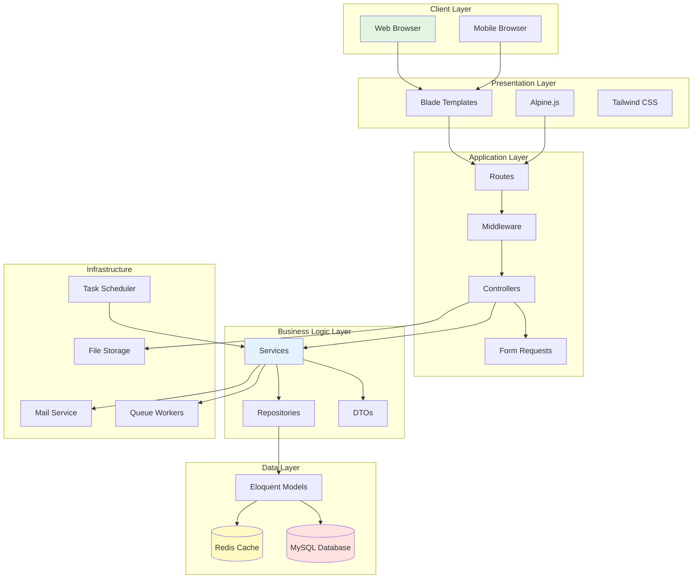

# 🏗️ ARCHITECTURE DOCUMENTATION

**SIMPEGRS - Sistem Informasi Manajemen Pegawai Rumah Sakit**  
**RSUD Haji Darlan Ismail**

Version: 1.0.0  
Last Updated: January 3, 2026

---

## 📋 Table of Contents

1. [System Overview](#1-system-overview)
2. [Architecture Patterns](#2-architecture-patterns)
3. [Directory Structure](#3-directory-structure)
4. [Design Patterns](#4-design-patterns)
5. [Database Architecture](#5-database-architecture)
6. [API Architecture](#6-api-architecture)
7. [Security Architecture](#7-security-architecture)
8. [Caching Strategy](#8-caching-strategy)
9. [File Storage](#9-file-storage)
10. [Performance Optimization](#10-performance-optimization)

---

## 1. System Overview

### 1.1 High-Level Architecture



### 1.2 Technology Stack

| Layer | Technology | Purpose |
|-------|------------|---------|
| **Backend Framework** | Laravel 10.x | Core application framework |
| **Programming Language** | PHP 8.1+ | Server-side logic |
| **Database** | MySQL 8.0+ | Primary data storage |
| **Cache** | Redis | Session, cache, queue |
| **Frontend** | Blade Templates | Server-side rendering |
| **JavaScript** | Alpine.js | Reactive components |
| **CSS** | Tailwind CSS | Utility-first styling |
| **Build Tool** | Vite | Asset bundling |
| **Queue** | Redis Queue | Background job processing |
| **Mail** | SMTP | Email notifications |
| **Storage** | Local/S3 | File storage |
| **Authentication** | Laravel Sanctum | API authentication (future) |
| **Authorization** | Spatie Permission | Role-based access control |

### 1.3 System Components

```
┌─────────────────────────────────────────────────────────────┐
│                     Web Application                          │
│  ┌─────────────┐  ┌──────────────┐  ┌──────────────┐       │
│  │   Employee  │  │   Manager    │  │      HR      │       │
│  │  Dashboard  │  │  Dashboard   │  │  Dashboard   │       │
│  └─────────────┘  └──────────────┘  └──────────────┘       │
│                                                              │
│  ┌─────────────────────────────────────────────────┐       │
│  │           Core Features                          │       │
│  │  - Attendance (GPS)  - Leave Management         │       │
│  │  - Shift Management  - Document Upload          │       │
│  │  - Approval Workflows                           │       │
│  └─────────────────────────────────────────────────┘       │
└─────────────────────────────────────────────────────────────┘
                          ↓
┌─────────────────────────────────────────────────────────────┐
│                    Business Logic                            │
│  ┌──────────────┐  ┌──────────────┐  ┌──────────────┐      │
│  │   Services   │  │     DTOs     │  │ Repositories │      │
│  └──────────────┘  └──────────────┘  └──────────────┘      │
└─────────────────────────────────────────────────────────────┘
                          ↓
┌─────────────────────────────────────────────────────────────┐
│                    Data Layer                                │
│  ┌──────────────┐  ┌──────────────┐  ┌──────────────┐      │
│  │    MySQL     │  │    Redis     │  │   Storage    │      │
│  │   Database   │  │    Cache     │  │   (Files)    │      │
│  └──────────────┘  └──────────────┘  └──────────────┘      │
└─────────────────────────────────────────────────────────────┘
```

---

## 2. Architecture Patterns

### 2.1 MVC Pattern (Model-View-Controller)

**Struktur:**
```
┌──────────┐         ┌──────────────┐         ┌───────┐
│  View    │ ← HTML ─│  Controller  │ ← Data ─│ Model │
│ (Blade)  │         │              │         │       │
└──────────┘         └──────────────┘         └───────┘
     ↑                      ↓                      ↓
     └──────── User ────────┘                  Database
```

**Implementation:**
- **Model:** `app/Models/` - Eloquent ORM models
- **View:** `resources/views/` - Blade templates
- **Controller:** `app/Http/Controllers/` - Request handlers

### 2.2 Service-Repository Pattern

**Purpose:** Separate business logic from data access

**Structure:**
```
Controller → Service → Repository → Model → Database
     ↓          ↓           ↓
  Request     DTO      Query Logic
```

**Example:**

```php
// Controller
class WorkerController extends Controller
{
    public function __construct(
        private WorkerService $workerService
    ) {}
    
    public function index()
    {
        $workers = $this->workerService->getAllWorkers();
        return view('workers.index', compact('workers'));
    }
}

// Service
class WorkerService
{
    public function __construct(
        private WorkerRepository $workerRepository
    ) {}
    
    public function getAllWorkers(): Collection
    {
        $workers = $this->workerRepository->getAll();
        return $workers->map(fn($worker) => new WorkerDTO($worker));
    }
}

// Repository
class WorkerRepository
{
    public function getAll(): Collection
    {
        return Worker::with(['department', 'position'])
            ->where('status', 'active')
            ->get();
    }
}
```

### 2.3 DTO Pattern (Data Transfer Objects)

**Purpose:** Transfer data between layers with type safety

**Structure:**
```php
class WorkerDTO
{
    public string $id;
    public string $nip;
    public string $name;
    public string $email;
    public string $departmentName;
    public string $positionName;
    public string $employmentStatus;
    
    public function __construct(Worker $worker)
    {
        $this->id = $worker->id;
        $this->nip = $worker->nip;
        $this->name = $worker->name;
        $this->email = $worker->email;
        $this->departmentName = $worker->department->name;
        $this->positionName = $worker->position->name;
        $this->employmentStatus = $worker->employment_status;
    }
    
    public function toArray(): array
    {
        return get_object_vars($this);
    }
}
```

### 2.4 Middleware Pipeline

**Request Flow:**
```
Request
   ↓
Middleware: EncryptCookies
   ↓
Middleware: VerifyCsrfToken
   ↓
Middleware: Authenticate
   ↓
Middleware: Role (HR/Manager/Employee)
   ↓
Middleware: Permission (can:view-workers)
   ↓
Controller
   ↓
Response
```

**Implementation:**
```php
// Route with middleware
Route::middleware(['auth', 'role:HR|Manager'])
    ->prefix('admin')
    ->group(function() {
        Route::get('/workers', [WorkerController::class, 'index']);
    });
```

---

## 3. Directory Structure

### 3.1 Application Structure

```
app/
├── Console/              # Artisan commands
│   ├── Commands/
│   └── Kernel.php
├── DTOs/                 # Data Transfer Objects
│   ├── Auth/
│   ├── Leave/
│   ├── Master/
│   ├── AttendanceDTO.php
│   ├── WorkerDTO.php
│   └── ...
├── Exceptions/           # Custom exceptions
│   └── Handler.php
├── Helpers/              # Helper functions
│   └── PermissionHelper.php
├── Http/
│   ├── Controllers/      # Request handlers
│   │   ├── Admin/
│   │   │   ├── Worker/
│   │   │   ├── Attendance/
│   │   │   └── MasterData/
│   │   ├── Employee/
│   │   │   ├── DashboardController.php
│   │   │   ├── AttendanceController.php
│   │   │   └── ProfileController.php
│   │   ├── Manager/
│   │   │   └── DashboardController.php
│   │   ├── HR/
│   │   │   └── HRDashboardController.php
│   │   └── Approval/
│   │       ├── LeaveApprovalController.php
│   │       ├── OvertimeApprovalController.php
│   │       └── DocumentApprovalController.php
│   ├── Middleware/       # HTTP middleware
│   │   ├── Authenticate.php
│   │   ├── CheckRole.php
│   │   └── LogActivity.php
│   └── Requests/         # Form validation
│       ├── Worker/
│       │   ├── StoreWorkerRequest.php
│       │   └── UpdateWorkerRequest.php
│       └── Attendance/
│           └── CheckInRequest.php
├── Models/               # Eloquent models
│   ├── User.php
│   ├── Worker.php
│   ├── Attendance.php
│   ├── LeaveRequest.php
│   └── ...
├── Providers/            # Service providers
│   ├── AppServiceProvider.php
│   ├── AuthServiceProvider.php
│   └── RouteServiceProvider.php
├── Repositories/         # Data access layer
│   ├── Attendance/
│   │   └── AttendanceRepository.php
│   ├── Worker/
│   │   └── WorkerRepository.php
│   └── Leave/
│       └── LeaveRepository.php
├── Services/             # Business logic
│   ├── Attendance/
│   │   └── AttendanceService.php
│   ├── Worker/
│   │   └── WorkerService.php
│   └── Leave/
│       └── LeaveService.php
└── Traits/               # Reusable traits
    └── HasUuid.php
```

### 3.2 Resources Structure

```
resources/
├── css/
│   └── app.css           # Tailwind styles
├── js/
│   ├── app.js            # Main JS file
│   └── components/       # Alpine components
└── views/
    ├── layouts/
    │   ├── app.blade.php       # Main layout
    │   ├── admin.blade.php     # Admin layout
    │   └── employee.blade.php  # Employee layout
    ├── components/
    │   ├── sidebar.blade.php
    │   ├── navbar.blade.php
    │   └── alerts.blade.php
    ├── admin/
    │   ├── workers/
    │   │   ├── index.blade.php
    │   │   ├── create.blade.php
    │   │   ├── edit.blade.php
    │   │   └── show.blade.php
    │   └── dashboard.blade.php
    ├── employee/
    │   ├── dashboard.blade.php
    │   ├── attendance/
    │   ├── leaves/
    │   └── profile/
    └── auth/
        ├── login.blade.php
        └── forgot-password.blade.php
```

### 3.3 Database Structure

```
database/
├── factories/            # Model factories for testing
│   ├── UserFactory.php
│   └── WorkerFactory.php
├── migrations/           # Database migrations
│   ├── 2025_12_05_000001_create_users_table.php
│   ├── 2025_12_10_000001_create_workers_table.php
│   └── ...
└── seeders/              # Database seeders
    ├── DatabaseSeeder.php
    ├── RoleSeeder.php
    ├── UserSeeder.php
    └── MasterDataSeeder.php
```

---

## 4. Design Patterns

### 4.1 Singleton Pattern

**Usage:** Service providers, database connections

```php
// Service container binding
$this->app->singleton(WorkerService::class, function ($app) {
    return new WorkerService(
        $app->make(WorkerRepository::class)
    );
});
```

### 4.2 Factory Pattern

**Usage:** Model factories for testing

```php
Worker::factory()->count(50)->create([
    'department_id' => Department::factory(),
    'status' => 'active',
]);
```

### 4.3 Observer Pattern

**Usage:** Model events

```php
// WorkerObserver
class WorkerObserver
{
    public function creating(Worker $worker)
    {
        if (empty($worker->id)) {
            $worker->id = Str::uuid();
        }
    }
    
    public function created(Worker $worker)
    {
        // Create user account
        User::create([
            'name' => $worker->name,
            'email' => $worker->email,
        ])->assignRole('Employee');
    }
}

// Register in AppServiceProvider
Worker::observe(WorkerObserver::class);
```

### 4.4 Strategy Pattern

**Usage:** Different approval strategies

```php
interface ApprovalStrategy
{
    public function canApprove(User $user, $request): bool;
    public function approve($request): void;
}

class ManagerApprovalStrategy implements ApprovalStrategy
{
    public function canApprove(User $user, $request): bool
    {
        return $user->hasRole('Manager') 
            && $user->department_id === $request->worker->department_id;
    }
    
    public function approve($request): void
    {
        $request->update([
            'status' => 'approved',
            'approved_by' => auth()->id(),
            'approved_at' => now(),
        ]);
    }
}

class HRApprovalStrategy implements ApprovalStrategy
{
    public function canApprove(User $user, $request): bool
    {
        return $user->hasRole('HR');
    }
    
    public function approve($request): void
    {
        // Same as manager
    }
}
```

### 4.5 Decorator Pattern

**Usage:** Middleware decorating requests

```php
// Each middleware decorates the request
class LogActivity
{
    public function handle($request, Closure $next)
    {
        $response = $next($request);
        
        // Log after response
        ActivityLog::create([
            'user_id' => auth()->id(),
            'action' => $request->route()->getActionMethod(),
            'ip' => $request->ip(),
        ]);
        
        return $response;
    }
}
```

---

## 5. Database Architecture

### 5.1 Database Schema Design

**Primary Key Strategy:** UUID v4

**Advantages:**
- Distributed system friendly
- No sequential ID leaks
- Merge-safe across databases

**Implementation:**
```php
// HasUuid trait
trait HasUuid
{
    protected static function bootHasUuid()
    {
        static::creating(function ($model) {
            if (empty($model->id)) {
                $model->id = (string) Str::uuid();
            }
        });
    }
    
    public function getIncrementing()
    {
        return false;
    }
    
    public function getKeyType()
    {
        return 'string';
    }
}
```

### 5.2 Relationship Types

**1. One-to-Many**
```php
// Department has many Workers
class Department extends Model
{
    public function workers()
    {
        return $this->hasMany(Worker::class);
    }
}

class Worker extends Model
{
    public function department()
    {
        return $this->belongsTo(Department::class);
    }
}
```

**2. Many-to-Many (Polymorphic)**
```php
// User has many Roles (via Spatie Permission)
$user->assignRole('Manager');
$user->hasRole('HR');
$user->givePermissionTo('view-workers');
```

**3. Self-Referencing**
```php
// ShiftSwapRequest
public function requester()
{
    return $this->belongsTo(Worker::class, 'requester_id');
}

public function target()
{
    return $this->belongsTo(Worker::class, 'target_id');
}
```

### 5.3 Indexing Strategy

```php
// Migration
Schema::create('attendances', function (Blueprint $table) {
    $table->uuid('id')->primary();
    $table->uuid('worker_id');
    $table->date('date');
    $table->time('check_in_time')->nullable();
    $table->time('check_out_time')->nullable();
    $table->enum('status', ['present', 'late', 'absent']);
    
    // Indexes
    $table->index('worker_id');
    $table->index('date');
    $table->index(['worker_id', 'date']); // Composite index
    $table->index('status');
    
    $table->foreign('worker_id')
          ->references('id')->on('workers')
          ->onDelete('cascade');
});
```

**Index Types:**
- **Primary Key:** UUID (id)
- **Foreign Keys:** Indexed automatically
- **Composite Index:** For multi-column queries (`worker_id` + `date`)
- **Status Fields:** Indexed for filtering

### 5.4 Soft Deletes

```php
class Worker extends Model
{
    use SoftDeletes;
    
    protected $dates = ['deleted_at'];
}

// Usage
$worker->delete();              // Soft delete
$worker->restore();             // Restore
$worker->forceDelete();         // Permanent delete
Worker::withTrashed()->get();   // Include soft deleted
```

---

## 6. API Architecture

### 6.1 RESTful API Design (Future)

**Endpoint Structure:**
```
GET    /api/v1/workers              # List workers
POST   /api/v1/workers              # Create worker
GET    /api/v1/workers/{id}         # Get worker
PUT    /api/v1/workers/{id}         # Update worker
DELETE /api/v1/workers/{id}         # Delete worker

POST   /api/v1/attendance/check-in  # Check-in
POST   /api/v1/attendance/check-out # Check-out
GET    /api/v1/attendance/history   # History

GET    /api/v1/leaves               # List leaves
POST   /api/v1/leaves               # Request leave
PUT    /api/v1/leaves/{id}/approve  # Approve leave
PUT    /api/v1/leaves/{id}/reject   # Reject leave
```

### 6.2 API Response Format

```php
// Success response
{
    "success": true,
    "data": {
        "id": "uuid",
        "nip": "12345",
        "name": "John Doe"
    },
    "message": "Worker created successfully",
    "meta": {
        "timestamp": "2026-01-03T10:00:00Z"
    }
}

// Error response
{
    "success": false,
    "error": {
        "code": "VALIDATION_ERROR",
        "message": "The given data was invalid",
        "details": {
            "email": ["The email has already been taken."]
        }
    },
    "meta": {
        "timestamp": "2026-01-03T10:00:00Z"
    }
}
```

### 6.3 API Authentication (Laravel Sanctum)

```php
// Generate token
$token = $user->createToken('mobile-app')->plainTextToken;

// Protected route
Route::middleware('auth:sanctum')->get('/user', function (Request $request) {
    return $request->user();
});
```

---

## 7. Security Architecture

### 7.1 Authentication Flow

```
1. User submits login (NIP/Email + Password)
   ↓
2. AuthController validates credentials
   ↓
3. Attempt authentication with Laravel Auth
   ↓
4. If success: Create session
   ↓
5. Redirect to role-based dashboard
```

### 7.2 Authorization Layers

**1. Role-Based (Spatie Permission)**
```php
// Check role
if ($user->hasRole('HR')) {
    // HR-specific logic
}

// Middleware
Route::middleware('role:HR|Manager')->group(function() {
    // Routes
});
```

**2. Permission-Based**
```php
// Check permission
if ($user->can('view-workers')) {
    // Show workers
}

// Gate
Gate::define('approve-leave', function (User $user, LeaveRequest $leave) {
    return $user->hasRole('Manager') 
        && $user->department_id === $leave->worker->department_id;
});
```

**3. Policy-Based**
```php
// WorkerPolicy
public function update(User $user, Worker $worker)
{
    return $user->hasRole('HR') 
        || ($user->hasRole('Manager') && $user->department_id === $worker->department_id);
}

// Usage
$this->authorize('update', $worker);
```

### 7.3 CSRF Protection

```php
// All POST requests require CSRF token
<form method="POST" action="/workers">
    @csrf
    <!-- Form fields -->
</form>
```

### 7.4 XSS Protection

```php
// Blade auto-escapes
{{ $user->name }}  // Auto-escaped

// Raw HTML (dangerous!)
{!! $html !!}  // Not escaped
```

### 7.5 SQL Injection Protection

```php
// Eloquent uses parameter binding
Worker::where('nip', $request->nip)->first();

// Raw queries with bindings
DB::select('SELECT * FROM workers WHERE nip = ?', [$nip]);
```

### 7.6 Rate Limiting

```php
// Throttle login attempts
Route::post('/login', [AuthController::class, 'login'])
    ->middleware('throttle:5,1'); // 5 attempts per minute
```

---

## 8. Caching Strategy

### 8.1 Cache Layers

```
┌─────────────────────┐
│   Application       │
└─────────────────────┘
         ↓
┌─────────────────────┐
│   ORM Cache         │  ← Eloquent query cache
└─────────────────────┘
         ↓
┌─────────────────────┐
│   Redis Cache       │  ← Application cache
└─────────────────────┘
         ↓
┌─────────────────────┐
│   Database          │
└─────────────────────┘
```

### 8.2 Cache Implementation

**1. Query Result Cache**
```php
// Cache for 1 hour
$departments = Cache::remember('departments', 3600, function () {
    return Department::all();
});
```

**2. Model Cache**
```php
// Automatic cache invalidation
class Worker extends Model
{
    protected static function booted()
    {
        static::saved(function () {
            Cache::forget('workers_list');
        });
        
        static::deleted(function () {
            Cache::forget('workers_list');
        });
    }
}
```

**3. View Cache**
```bash
# Cache compiled views
php artisan view:cache
```

**4. Config Cache**
```bash
# Cache configuration
php artisan config:cache
```

**5. Route Cache**
```bash
# Cache routes
php artisan route:cache
```

### 8.3 Cache Keys Convention

```
Format: {prefix}:{entity}:{id}:{attribute}

Examples:
- app:worker:uuid-123:profile
- app:attendance:2026-01-03:summary
- app:department:uuid-456:workers
```

---

## 9. File Storage

### 9.1 Storage Structure

```
storage/
├── app/
│   ├── public/               # Public files (via symlink)
│   │   ├── workers/          # Worker photos
│   │   │   └── {worker_id}/
│   │   │       └── profile.jpg
│   │   ├── attendance/       # Attendance photos
│   │   │   └── {date}/
│   │   │       └── {worker_id}_{timestamp}.jpg
│   │   └── documents/        # Worker documents
│   │       └── {worker_id}/
│   │           └── {document_id}.pdf
│   └── private/              # Private files
│       └── exports/          # Excel exports (temporary)
├── framework/
│   ├── cache/
│   ├── sessions/
│   └── views/
└── logs/
    └── laravel.log
```

### 9.2 File Upload Handling

```php
// Store file
$path = $request->file('photo')->store('attendance/' . now()->format('Y-m-d'), 'public');

// Generate URL
$url = Storage::disk('public')->url($path);

// Delete file
Storage::disk('public')->delete($path);
```

### 9.3 S3 Storage (Future)

```php
// .env
FILESYSTEM_DISK=s3
AWS_ACCESS_KEY_ID=xxx
AWS_SECRET_ACCESS_KEY=xxx
AWS_DEFAULT_REGION=ap-southeast-1
AWS_BUCKET=simpegrs-storage

// Store to S3
$path = Storage::disk('s3')->put('documents', $file);
```

---

## 10. Performance Optimization

### 10.1 Database Optimization

**1. Eager Loading (N+1 Query Prevention)**
```php
// Bad (N+1 queries)
$workers = Worker::all();
foreach ($workers as $worker) {
    echo $worker->department->name; // Query per iteration
}

// Good (2 queries)
$workers = Worker::with('department')->get();
foreach ($workers as $worker) {
    echo $worker->department->name;
}
```

**2. Chunk Large Results**
```php
Worker::chunk(100, function ($workers) {
    foreach ($workers as $worker) {
        // Process
    }
});
```

**3. Index Usage**
```php
// Use indexed columns in WHERE
Worker::where('nip', $nip)->first(); // nip is indexed

// Avoid functions on indexed columns
// Bad
Worker::whereRaw('LOWER(name) = ?', [strtolower($name)])->get();

// Good
Worker::where('name', $name)->get();
```

### 10.2 Caching Strategies

**1. Cache Frequently Accessed Data**
```php
$masterData = Cache::remember('master_data', 3600, function () {
    return [
        'departments' => Department::all(),
        'positions' => Position::all(),
        'shifts' => Shift::all(),
    ];
});
```

**2. Cache Expensive Queries**
```php
$stats = Cache::remember('hr_dashboard_stats', 600, function () {
    return [
        'total_workers' => Worker::count(),
        'active_workers' => Worker::where('status', 'active')->count(),
        'attendance_today' => Attendance::whereDate('date', today())->count(),
    ];
});
```

### 10.3 Queue Jobs

**1. Export Jobs**
```php
// Instead of sync export
dispatch(new ExportWorkersJob($filters))->onQueue('exports');
```

**2. Email Notifications**
```php
Mail::to($user)->queue(new ApprovalNotification($leave));
```

**3. Heavy Processing**
```php
dispatch(new ProcessMonthlyPayroll($month))->onQueue('payroll');
```

### 10.4 Asset Optimization

**1. Minification**
```bash
npm run build  # Minifies CSS/JS with Vite
```

**2. Image Optimization**
```php
// Resize and optimize on upload
$image = Image::make($file)
    ->resize(800, null, function ($constraint) {
        $constraint->aspectRatio();
    })
    ->encode('jpg', 80);
```

**3. CDN (Future)**
```env
ASSET_URL=https://cdn.yourdomain.com
```

### 10.5 Response Caching

```php
// HTTP cache headers
return response()->view('dashboard')
    ->header('Cache-Control', 'public, max-age=600');
```

### 10.6 Database Connection Pooling

```php
// config/database.php
'mysql' => [
    'driver' => 'mysql',
    'pool' => [
        'min' => 2,
        'max' => 10,
    ],
],
```

---

## 🎯 Architecture Principles

### SOLID Principles

1. **Single Responsibility:** Each class has one responsibility
2. **Open/Closed:** Open for extension, closed for modification
3. **Liskov Substitution:** Derived classes can substitute base classes
4. **Interface Segregation:** Specific interfaces over general
5. **Dependency Inversion:** Depend on abstractions, not concretions

### DRY (Don't Repeat Yourself)

- Use Traits for reusable functionality
- Use Services for business logic
- Use Repositories for data access

### KISS (Keep It Simple, Stupid)

- Simple solutions over complex ones
- Clear naming conventions
- Readable code over clever code

### YAGNI (You Aren't Gonna Need It)

- Don't build features you don't need yet
- Implement when required, not in advance

---

**Version:** 1.0.0  
**Last Updated:** January 3, 2026  
**Prepared by:** IT Team - RSUD Haji Darlan Ismail
