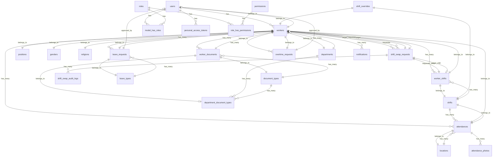

# 📊 Database Documentation - SIMPEGRS RSUD Haji Darlan Ismail

**Project:** Sistem Informasi Manajemen Pegawai Rumah Sakit  
**Database Type:** MySQL/PostgreSQL  
**Version:** 1.0.0  
**Last Updated:** January 3, 2026

---

## 📋 Table of Contents

1. [Database Overview](#database-overview)
2. [ERD (Entity Relationship Diagram)](#erd-entity-relationship-diagram)
3. [Table Structures](#table-structures)
4. [Relationships](#relationships)
5. [Indexes & Constraints](#indexes--constraints)

---

## 🗂️ Database Overview

### Statistics
- **Total Tables:** 26
- **Main Entities:** 19
- **Junction Tables:** 3
- **System Tables:** 4

### Database Categories

#### 1. **Authentication & Authorization**
- `users` - User accounts
- `roles` - User roles (Spatie Permission)
- `permissions` - System permissions
- `model_has_roles` - User-Role relationships
- `model_has_permissions` - User-Permission relationships
- `role_has_permissions` - Role-Permission relationships

#### 2. **Master Data**
- `departments` - Company departments
- `positions` - Job positions
- `genders` - Gender reference
- `religions` - Religion reference
- `locations` - Office locations (with GPS coordinates)
- `shifts` - Work shifts
- `leave_types` - Types of leave (annual, sick, etc.)
- `document_types` - Types of documents required
- `holidays` - National/company holidays

#### 3. **Human Resources**
- `workers` - Employee master data
- `worker_documents` - Employee document management
- `worker_shifts` - Employee shift assignments

#### 4. **Attendance Management**
- `attendances` - Daily attendance records
- `attendance_photos` - Check-in/out photos
- `shift_overrides` - Temporary shift changes

#### 5. **Leave & Overtime**
- `leave_requests` - Leave applications
- `overtime_requests` - Overtime applications

#### 6. **Shift Management**
- `shift_swap_requests` - Shift exchange requests
- `shift_swap_audit_logs` - Audit trail for shift swaps

#### 7. **System Tables**
- `notifications` - System notifications
- `personal_access_tokens` - API tokens (Sanctum)
- `cache` - Application cache
- `jobs` - Queue jobs

---

## 🔗 ERD (Entity Relationship Diagram)



---

## 📊 Table Structures

### 1. **users**
Primary authentication table.

| Column | Type | Nullable | Default | Description |
|--------|------|----------|---------|-------------|
| id | BIGINT UNSIGNED | NO | AUTO | Primary key |
| name | VARCHAR(255) | NO | - | Full name |
| email | VARCHAR(255) | NO | - | Email (unique) |
| email_verified_at | TIMESTAMP | YES | NULL | Email verification |
| password | VARCHAR(255) | NO | - | Hashed password |
| remember_token | VARCHAR(100) | YES | NULL | Remember me token |
| created_at | TIMESTAMP | YES | NULL | Creation timestamp |
| updated_at | TIMESTAMP | YES | NULL | Update timestamp |

**Indexes:** UNIQUE(email)

---

### 2. **workers**
Employee master data.

| Column | Type | Nullable | Default | Description |
|--------|------|----------|---------|-------------|
| id | UUID | NO | - | Primary key |
| user_id | BIGINT UNSIGNED | YES | NULL | FK to users |
| nip | VARCHAR(50) | NO | - | Employee ID (unique) |
| name | VARCHAR(255) | NO | - | Full name |
| email | VARCHAR(255) | YES | NULL | Email |
| phone_number | VARCHAR(20) | YES | NULL | Phone number |
| date_of_birth | DATE | YES | NULL | Birth date |
| address | TEXT | YES | NULL | Full address |
| gender_id | UUID | YES | NULL | FK to genders |
| religion_id | UUID | YES | NULL | FK to religions |
| department_id | UUID | YES | NULL | FK to departments |
| position_id | UUID | YES | NULL | FK to positions |
| employment_status | ENUM | NO | contract | permanent/contract/probation/intern |
| status | ENUM | NO | active | active/inactive/resigned |
| join_date | DATE | YES | NULL | Join date |
| resign_date | DATE | YES | NULL | Resignation date |
| created_at | TIMESTAMP | YES | NULL | Creation timestamp |
| updated_at | TIMESTAMP | YES | NULL | Update timestamp |
| deleted_at | TIMESTAMP | YES | NULL | Soft delete |

**Indexes:** UNIQUE(nip), INDEX(email), FK(user_id, gender_id, religion_id, department_id, position_id)

---

### 3. **attendances**
Daily attendance records with GPS validation.

| Column | Type | Nullable | Default | Description |
|--------|------|----------|---------|-------------|
| id | UUID | NO | - | Primary key |
| worker_id | UUID | NO | - | FK to workers |
| shift_id | UUID | NO | - | FK to shifts |
| location_id | UUID | NO | - | FK to locations |
| attendance_date | DATE | NO | - | Attendance date |
| check_in | DATETIME | YES | NULL | Check-in time |
| check_out | DATETIME | YES | NULL | Check-out time |
| check_in_latitude | DECIMAL(10,8) | YES | NULL | Check-in GPS latitude |
| check_in_longitude | DECIMAL(11,8) | YES | NULL | Check-in GPS longitude |
| check_out_latitude | DECIMAL(10,8) | YES | NULL | Check-out GPS latitude |
| check_out_longitude | DECIMAL(11,8) | YES | NULL | Check-out GPS longitude |
| distance_check_in | DECIMAL(8,2) | YES | NULL | Distance from office (m) |
| distance_check_out | DECIMAL(8,2) | YES | NULL | Distance from office (m) |
| is_late | BOOLEAN | NO | false | Late flag |
| late_minutes | INTEGER | YES | 0 | Minutes late |
| is_early_leave | BOOLEAN | NO | false | Early leave flag |
| early_leave_minutes | INTEGER | YES | 0 | Minutes early |
| is_outside_radius | BOOLEAN | NO | false | Outside office radius |
| work_hours | DECIMAL(5,2) | YES | NULL | Total work hours |
| status | ENUM | NO | present | present/late/absent/leave/sick/permission |
| notes | TEXT | YES | NULL | Additional notes |
| created_at | TIMESTAMP | YES | NULL | Creation timestamp |
| updated_at | TIMESTAMP | YES | NULL | Update timestamp |

**Indexes:** INDEX(worker_id, attendance_date), FK(worker_id, shift_id, location_id)

---

### 4. **leave_requests**
Employee leave applications.

| Column | Type | Nullable | Default | Description |
|--------|------|----------|---------|-------------|
| id | UUID | NO | - | Primary key |
| worker_id | UUID | NO | - | FK to workers |
| leave_type_id | UUID | NO | - | FK to leave_types |
| start_date | DATE | NO | - | Leave start date |
| end_date | DATE | NO | - | Leave end date |
| total_days | INTEGER | NO | - | Total leave days |
| reason | TEXT | NO | - | Reason for leave |
| status | ENUM | NO | pending | pending/approved/rejected/cancelled |
| approved_by | BIGINT UNSIGNED | YES | NULL | FK to users (approver) |
| approved_at | TIMESTAMP | YES | NULL | Approval timestamp |
| approval_notes | TEXT | YES | NULL | Approval notes |
| rejection_reason | TEXT | YES | NULL | Rejection reason |
| attachment | VARCHAR(255) | YES | NULL | Supporting document |
| created_at | TIMESTAMP | YES | NULL | Creation timestamp |
| updated_at | TIMESTAMP | YES | NULL | Update timestamp |

**Indexes:** INDEX(worker_id, status), FK(worker_id, leave_type_id, approved_by)

---

### 5. **overtime_requests**
Overtime work applications.

| Column | Type | Nullable | Default | Description |
|--------|------|----------|---------|-------------|
| id | UUID | NO | - | Primary key |
| worker_id | UUID | NO | - | FK to workers |
| date | DATE | NO | - | Overtime date |
| start_time | TIME | NO | - | Start time |
| end_time | TIME | NO | - | End time |
| total_hours | DECIMAL(5,2) | NO | - | Total hours |
| reason | TEXT | NO | - | Reason for overtime |
| status | ENUM | NO | pending | pending/approved/rejected/cancelled |
| approved_by | BIGINT UNSIGNED | YES | NULL | FK to users (approver) |
| approved_at | TIMESTAMP | YES | NULL | Approval timestamp |
| approval_notes | TEXT | YES | NULL | Approval notes |
| rejection_reason | TEXT | YES | NULL | Rejection reason |
| created_at | TIMESTAMP | YES | NULL | Creation timestamp |
| updated_at | TIMESTAMP | YES | NULL | Update timestamp |

**Indexes:** INDEX(worker_id, date, status), FK(worker_id, approved_by)

---

### 6. **shift_swap_requests**
Shift exchange system with approval workflow.

| Column | Type | Nullable | Default | Description |
|--------|------|----------|---------|-------------|
| id | UUID | NO | - | Primary key |
| requester_id | UUID | NO | - | FK to workers (requester) |
| requester_shift_id | UUID | NO | - | FK to worker_shifts |
| target_worker_id | UUID | YES | NULL | FK to workers (target) |
| target_shift_id | UUID | YES | NULL | FK to worker_shifts |
| reason | TEXT | YES | NULL | Reason for swap |
| status | ENUM | NO | pending | pending/accepted/rejected/cancelled/approved/completed |
| target_response_at | TIMESTAMP | YES | NULL | Target response time |
| manager_approved_by | BIGINT UNSIGNED | YES | NULL | FK to users (manager) |
| manager_approved_at | TIMESTAMP | YES | NULL | Manager approval time |
| manager_notes | TEXT | YES | NULL | Manager notes |
| created_at | TIMESTAMP | YES | NULL | Creation timestamp |
| updated_at | TIMESTAMP | YES | NULL | Update timestamp |

**Indexes:** INDEX(requester_id, status), FK(requester_id, target_worker_id, requester_shift_id, target_shift_id)

---

### 7. **departments**
Organization departments.

| Column | Type | Nullable | Default | Description |
|--------|------|----------|---------|-------------|
| id | UUID | NO | - | Primary key |
| name | VARCHAR(255) | NO | - | Department name |
| code | VARCHAR(50) | YES | NULL | Department code |
| description | TEXT | YES | NULL | Description |
| created_at | TIMESTAMP | YES | NULL | Creation timestamp |
| updated_at | TIMESTAMP | YES | NULL | Update timestamp |

---

### 8. **locations**
Office locations with GPS coordinates.

| Column | Type | Nullable | Default | Description |
|--------|------|----------|---------|-------------|
| id | UUID | NO | - | Primary key |
| name | VARCHAR(255) | NO | - | Location name |
| address | TEXT | YES | NULL | Full address |
| latitude | DECIMAL(10,8) | NO | - | GPS latitude |
| longitude | DECIMAL(11,8) | NO | - | GPS longitude |
| radius | INTEGER | NO | 100 | Valid radius (meters) |
| is_active | BOOLEAN | NO | true | Active status |
| created_at | TIMESTAMP | YES | NULL | Creation timestamp |
| updated_at | TIMESTAMP | YES | NULL | Update timestamp |

---

### 9. **shifts**
Work shift definitions.

| Column | Type | Nullable | Default | Description |
|--------|------|----------|---------|-------------|
| id | UUID | NO | - | Primary key |
| name | VARCHAR(255) | NO | - | Shift name |
| code | VARCHAR(50) | YES | NULL | Shift code |
| start_time | TIME | NO | - | Shift start time |
| end_time | TIME | NO | - | Shift end time |
| grace_period_minutes | INTEGER | NO | 15 | Grace period for late |
| is_overnight | BOOLEAN | NO | false | Crosses midnight |
| is_active | BOOLEAN | NO | true | Active status |
| description | TEXT | YES | NULL | Description |
| created_at | TIMESTAMP | YES | NULL | Creation timestamp |
| updated_at | TIMESTAMP | YES | NULL | Update timestamp |

---

### 10. **holidays**
National and company holidays.

| Column | Type | Nullable | Default | Description |
|--------|------|----------|---------|-------------|
| id | UUID | NO | - | Primary key |
| name | VARCHAR(255) | NO | - | Holiday name |
| date | DATE | NO | - | Holiday date |
| is_national | BOOLEAN | NO | true | National holiday flag |
| description | TEXT | YES | NULL | Description |
| created_at | TIMESTAMP | YES | NULL | Creation timestamp |
| updated_at | TIMESTAMP | YES | NULL | Update timestamp |

**Indexes:** INDEX(date), UNIQUE(date, name)

---

## 🔑 Key Relationships

### One-to-One
- `users` → `workers` (One user has one worker profile)

### One-to-Many
- `workers` → `attendances` (One worker has many attendance records)
- `workers` → `leave_requests` (One worker can request many leaves)
- `workers` → `overtime_requests` (One worker can request many overtimes)
- `workers` → `worker_documents` (One worker has many documents)
- `departments` → `workers` (One department has many workers)
- `shifts` → `attendances` (One shift is used in many attendances)

### Many-to-One
- `attendances` → `workers` (Many attendances belong to one worker)
- `leave_requests` → `workers` (Many leave requests belong to one worker)
- `workers` → `departments` (Many workers belong to one department)

### Self-Referencing
- `shift_swap_requests` → `workers` (requester and target are both workers)

### Polymorphic (via Spatie Permission)
- `model_has_roles` (Users can have multiple roles)
- `model_has_permissions` (Users can have direct permissions)

---

## 📈 Data Flow Summary

### Attendance Flow
```
Worker → Check-in (GPS validation) → Attendance Record → Check-out → Calculate work hours
```

### Leave Request Flow
```
Worker submits → Pending → Manager/HR reviews → Approved/Rejected → Worker notified
```

### Overtime Request Flow
```
Worker submits → Pending → Manager/HR reviews → Approved/Rejected → Worker notified
```

### Shift Swap Flow
```
Requester initiates → Target accepts/rejects → Manager approves → System swaps shifts
```

---

## 🔐 Security Features

1. **UUID Primary Keys** - Prevents ID enumeration attacks
2. **Soft Deletes** - Maintains data integrity and audit trail
3. **Role-Based Access Control** (Spatie Permission)
4. **GPS Validation** - Ensures physical presence at check-in/out
5. **Timestamps** - Tracks all data modifications
6. **Foreign Key Constraints** - Maintains referential integrity

---

## 📝 Notes

- All tables use UUID for primary keys except system tables (users, roles, permissions)
- Timestamps (`created_at`, `updated_at`) are automatically managed by Laravel
- Soft deletes implemented on critical tables (workers, attendances, etc.)
- GPS coordinates stored with 8 decimal precision (~1mm accuracy)
- Enum values are validated at application level

---

**Document Version:** 1.0.0  
**Last Updated:** January 3, 2026  
**Maintained By:** Development Team
