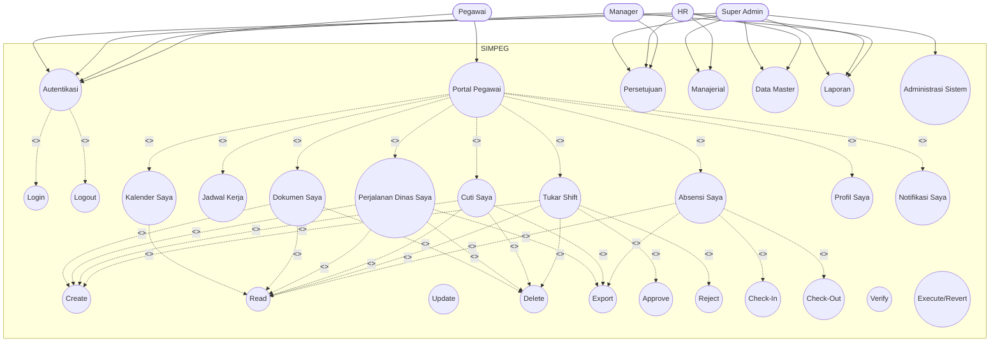

# Use Case Sistem SIMPEG (Berdasarkan Fitur & Tampilan)

Dokumen ini disusun dari:
- Menu dan kelompok fitur pada sidebar aplikasi.
- Route aktif di aplikasi web.

## Aktor

- Pegawai
- Manager
- HR
- Super Admin

## Daftar Use Case per Aktor

### 1) Pegawai

- Login ke sistem
- Logout dari sistem
- Lihat dashboard pegawai
- Lihat riwayat absensi pribadi
- Check-in mandiri
- Check-out mandiri
- Export absensi pribadi
- Lihat jadwal kerja
- Ajukan tukar shift
- Terima/tolak/cancel permintaan tukar shift
- Ajukan cuti
- Batalkan pengajuan cuti
- Export riwayat cuti pribadi
- Ajukan perjalanan dinas
- Batalkan pengajuan perjalanan dinas
- Export riwayat perjalanan dinas pribadi
- Upload dokumen pribadi
- Lihat/download/hapus dokumen pribadi
- Lihat kalender event kerja
- Lihat dan ubah profil
- Ubah password
- Lihat dan kelola notifikasi

### 2) Manager

- Login/Logout
- Lihat dashboard manager
- Lihat daftar persetujuan cuti
- Setujui/tolak permintaan cuti
- Lihat daftar persetujuan tukar shift
- Setujui/tolak/eksekusi/revert tukar shift
- Lihat daftar persetujuan perjalanan dinas
- Setujui/tolak perjalanan dinas
- Lihat laporan (absensi, cuti, dokumen)
- Export laporan
- Lihat notifikasi

### 3) HR

- Login/Logout
- Lihat dashboard HR
- Kelola data pegawai (CRUD, import, export, resign)
- Kelola off-day pegawai (pattern, pengecekan tanggal, range)
- Kelola absensi admin (check-in/check-out pegawai, histori, statistik, export)
- Kelola jadwal pegawai (CRUD, generate jadwal)
- Kelola shift override (CRUD, bulk create)
- Kelola permintaan cuti (CRUD + approve/reject/cancel)
- Kelola dokumen pegawai (CRUD + verify/reject + download)
- Kelola data master (departemen, shift, jenis cuti, jenis dokumen, mapping dokumen)
- Kelola hari libur (manual, bulk, auto-generate)
- Kelola persetujuan (cuti, dokumen, perjalanan dinas, tukar shift)
- Lihat dan export laporan
- Kelola notifikasi

### 4) Super Admin

- Memiliki seluruh use case HR
- Kelola role dan permission
- Kelola akun pengguna (CRUD)
- Lihat audit log sistem

## Diagram Use Case Parent-Child (`<<include>>` dan `<<extend>>`)

## Relasi Parent-Child per Fitur (Lengkap)

Keterangan:
- `<<include>>` = selalu bagian dari parent use case.
- `<<extend>>` = skenario tambahan/opsional berbasis kondisi atau role.

### 1) Autentikasi

- Parent: `Autentikasi`
- Child `<<include>>`: `Login`, `Logout`
- Child `<<extend>>`: `Lupa Password`, `Reset Password`

### 2) Portal Pegawai

- Parent: `Portal Pegawai`
- Child `<<include>>`: `Absensi Saya`, `Jadwal Kerja`, `Tukar Shift`, `Cuti Saya`, `Perjalanan Dinas Saya`, `Dokumen Saya`, `Kalender Saya`, `Profil Saya`, `Notifikasi Saya`

#### 2.1 Absensi Saya
- `<<include>>`: `Read` (lihat riwayat absensi)
- `<<extend>>`: `Check-In`, `Check-Out`, `Export`

#### 2.2 Jadwal Kerja
- `<<include>>`: `Read`

#### 2.3 Tukar Shift
- `<<include>>`: `Create` (ajukan), `Read`
- `<<extend>>`: `Approve/Accept`, `Reject`, `Delete` (cancel)

#### 2.4 Cuti Saya
- `<<include>>`: `Create` (ajukan), `Read`
- `<<extend>>`: `Delete` (batalkan), `Export`

#### 2.5 Perjalanan Dinas Saya
- `<<include>>`: `Create` (ajukan), `Read`
- `<<extend>>`: `Delete` (batalkan), `Export`

#### 2.6 Dokumen Saya
- `<<include>>`: `Create` (upload), `Read`
- `<<extend>>`: `Delete`, `Download`

#### 2.7 Kalender Saya (khusus read-only)
- `<<include>>`: `Read`
- `<<extend>>`: tidak ada

#### 2.8 Profil Saya
- `<<include>>`: `Read`, `Update`
- `<<extend>>`: `Update Password`

#### 2.9 Notifikasi Saya
- `<<include>>`: `Read`
- `<<extend>>`: `Mark as Read`, `Mark All as Read`, `Delete`

### 3) Persetujuan

- Parent: `Persetujuan`
- Child `<<include>>`: `Persetujuan Cuti`, `Persetujuan Tukar Shift`, `Persetujuan Dokumen`, `Persetujuan Perjalanan Dinas`

#### 3.1 Persetujuan Cuti
- `<<include>>`: `Read`
- `<<extend>>`: `Approve`, `Reject`

#### 3.2 Persetujuan Tukar Shift
- `<<include>>`: `Read`
- `<<extend>>`: `Approve`, `Reject`, `Execute`, `Revert`, `Export`

#### 3.3 Persetujuan Dokumen
- `<<include>>`: `Read`
- `<<extend>>`: `Verify`, `Reject`

#### 3.4 Persetujuan Perjalanan Dinas
- `<<include>>`: `Read`
- `<<extend>>`: `Approve`, `Reject`, `Export`

### 4) Manajerial

- Parent: `Manajerial`
- Child `<<include>>`: `Kelola Pegawai`, `Kelola Absensi Admin`, `Kelola Jadwal Pegawai`, `Kelola Shift Override`, `Kelola Dokumen Pegawai`

#### 4.1 Kelola Pegawai
- `<<include>>`: `Create`, `Read`, `Update`, `Delete`
- `<<extend>>`: `Import`, `Export`, `Resign`, `Kelola Off-Day`

#### 4.2 Kelola Absensi Admin
- `<<include>>`: `Read`
- `<<extend>>`: `Check-In by Admin`, `Check-Out by Admin`, `Update`, `Delete`, `Export`, `Lihat Statistik`

#### 4.3 Kelola Jadwal Pegawai
- `<<include>>`: `Create`, `Read`, `Update`, `Delete`
- `<<extend>>`: `Generate Jadwal`, `Lihat Kalender Jadwal`

#### 4.4 Kelola Shift Override
- `<<include>>`: `Create`, `Read`, `Update`, `Delete`
- `<<extend>>`: `Bulk Create`

#### 4.5 Kelola Dokumen Pegawai
- `<<include>>`: `Create`, `Read`, `Update`, `Delete`
- `<<extend>>`: `Verify`, `Reject`, `Download`, `Filter Expired/Expiring`

### 5) Data Master

- Parent: `Data Master`
- Child `<<include>>`: `Departemen`, `Shift`, `Jenis Cuti`, `Jenis Dokumen`, `Mapping Dokumen Posisi`

Untuk setiap child data master:
- `<<include>>`: `Create`, `Read`, `Update`, `Delete`

### 6) Hari Libur

- Parent: `Kelola Hari Libur`
- `<<include>>`: `Create`, `Read`, `Update`, `Delete`
- `<<extend>>`: `Bulk Create`, `Auto Generate`

### 7) Laporan

- Parent: `Laporan`
- Child `<<include>>`: `Laporan Absensi`, `Laporan Cuti`, `Laporan Dokumen`
- Untuk setiap child:
  - `<<include>>`: `Read`
  - `<<extend>>`: `Export`

### 8) Administrasi Sistem

- Parent: `Administrasi Sistem`
- Child `<<include>>`: `Kelola Role`, `Kelola User`, `Audit Log`

#### 8.1 Kelola Role
- `<<include>>`: `Create`, `Read`, `Update`, `Delete`

#### 8.2 Kelola User
- `<<include>>`: `Create`, `Read`, `Update`, `Delete`
- `<<extend>>`: `Assign Role`, `Reset Password`, `Deactivate User`

#### 8.3 Audit Log
- `<<include>>`: `Read`

## Mapping Tampilan ke Modul Use Case

- Data Master: Departemen, Shift Kerja, Jenis Cuti, Jenis Dokumen, Dokumen Posisi.
- Manajerial: Data Pegawai, Rekap Absensi, Jadwal Pegawai, Berkas Pegawai.
- Persetujuan: Permohonan Cuti, Tukar Shift, Perjalanan Dinas.
- Portal Pegawai: Absensi Saya, Jadwal Kerja, Tukar Shift, Cuti Saya, Perjalanan Dinas, Dokumen Saya, Kalender, Profil.
- Administrasi Sistem: Role, Pengguna, Hari Libur, Audit Log, Laporan.

## Catatan

- Use case di atas mengikuti fitur yang tampil pada sidebar dan route yang aktif.
- Beberapa halaman lama masih ada di folder view, tetapi tidak dijadikan sumber utama jika tidak terlihat pada alur menu aktif.
