# Class Diagram SIMPEG (Sistem Informasi Kepegawaian)

Berikut adalah representasi *Class Diagram* (bahasa Indonesia) untuk arsitektur entitas data pada sistem SIMPEG. Nama entitas, atribut, relasi, dan operasi ditulis dalam bahasa Indonesia.

```mermaid
classDiagram
    class Pengguna {
+ Uuid id
+ Uuid id_pegawai
+ String email
+ String nama_pengguna
+ String kata_sandi
+ DateTime email_terverifikasi_pada
+ DateTime login_terakhir
+ Boolean aktif
+ create(data) Pengguna
+ read(id) Pengguna
+ update(id, data) Boolean
+ delete(id) Boolean
+ login(email, password) Token
+ logout() Boolean
+ pegawai() Pegawai
+ peran() Collection
+ modelMemilikiPeran() Collection
+ modelMemilikiIzin() Collection
+ tokenResetKataSandi() Collection
    }

    class Peran {
+ BigInt id
+ String nama
+ String nama_penjaga
+ create(data) Peran
+ read(id) Peran
+ update(id, data) Boolean
+ delete(id) Boolean
+ pengguna() Collection
+ peranMemilikiIzin() Collection
+ modelMemilikiPeran() Collection
    }

    class Pegawai {
+ Uuid id
+ String nip
+ String nama
+ String email
+ String nomor_telepon
+ String alamat
+ Date tanggal_lahir
+ String tempat_lahir
+ String jenis_kelamin
+ String agama
+ Uuid id_departemen
+ Uuid id_shift
+ Date tanggal_bergabung
+ Date tanggal_resign
+ String status_kepegawaian
+ String status
+ String url_foto
+ create(data) Pegawai
+ read(id) Pegawai
+ update(id, data) Boolean
+ delete(id) Boolean
+ tetapkanShift(idShift, tanggal) Boolean
+ pengguna() Pengguna
+ departemen() Departemen
+ presensi() Collection
+ jadwalShift() Collection
+ riwayatShiftPegawai() Collection
+ penyesuaianShift() Collection
+ pengajuanCuti() Collection
+ perjalananDinas() Collection
+ dokumenPegawai() Collection
    }

    class Departemen {
+ Uuid id
+ String nama
+ String kode
+ String deskripsi
+ Boolean aktif
+ Boolean wajib_hadir_hari_libur
+ Uuid id_departemen_induk
+ Uuid id_manajer
+ create(data) Departemen
+ read(id) Departemen
+ update(id, data) Boolean
+ delete(id) Boolean
+ pegawai() Collection
+ tipeDokumenDepartemen() Collection
    }

    class Shift {
+ Uuid id
+ String nama
+ Time waktu_mulai
+ Time waktu_selesai
+ Int total_jam
+ Int menit_toleransi
+ Boolean lintas_hari
+ Boolean aktif
+ create(data) Shift
+ read(id) Shift
+ update(id, data) Boolean
+ delete(id) Boolean
+ jadwalShiftPegawai() Collection
+ riwayatShiftPegawai() Collection
+ hariDalamShift() Collection
+ penyesuaianShift() Collection
+ kehadiran() Collection
    }

    class JadwalShiftPegawai {
+ Uuid id
+ Uuid id_pegawai
+ Uuid id_shift
+ Date berlaku_mulai
+ Date berlaku_sampai
+ Boolean aktif
+ String catatan
+ create(data) JadwalShiftPegawai
+ read(id) JadwalShiftPegawai
+ update(id, data) Boolean
+ delete(id) Boolean
    }

    class RiwayatShiftPegawai {
+ Uuid id
+ Uuid id_pegawai
+ Uuid id_shift
+ Date berlaku_mulai
+ Date berlaku_sampai
+ Uuid diubah_oleh
+ String alasan
+ create(data) RiwayatShiftPegawai
+ read(id) RiwayatShiftPegawai
+ update(id, data) Boolean
+ delete(id) Boolean
    }

    class HariDalamShift {
+ Uuid id
+ Uuid id_shift
+ Int hari_dalam_minggu
+ Time waktu_mulai
+ Time waktu_selesai
+ create(data) HariDalamShift
+ read(id) HariDalamShift
+ update(id, data) Boolean
+ delete(id) Boolean
    }

    class PenyesuaianShift {
+ Uuid id
+ Uuid id_pegawai
+ Uuid id_shift
+ Date tanggal_penyesuaian
+ String alasan
+ Uuid dibuat_oleh
+ Uuid id_pengajuan_tukar_shift
+ create(data) PenyesuaianShift
+ read(id) PenyesuaianShift
+ update(id, data) Boolean
+ delete(id) Boolean
    }

    class HariLiburPegawai {
+ Uuid id
+ Uuid id_pegawai
+ Date tanggal_libur
+ String catatan
+ Uuid dibuat_oleh
+ create(data) HariLiburPegawai
+ read(id) HariLiburPegawai
+ update(id, data) Boolean
+ delete(id) Boolean
    }

    class Kehadiran {
+ Uuid id
+ Uuid id_pegawai
+ Uuid id_shift
+ Date tanggal_kehadiran
+ DateTime waktu_masuk
+ DateTime waktu_keluar
+ String status
+ Boolean terlambat
+ Int menit_terlambat
+ Boolean pulang_cepat
+ Int menit_pulang_cepat
+ String catatan
+ create(data) Kehadiran
+ read(id) Kehadiran
+ update(id, data) Boolean
+ delete(id) Boolean
+ checkIn(idPegawai, waktu) Boolean
+ checkOut(idPegawai, waktu) Boolean
+ pegawai() Pegawai
+ fotoKehadiran() Collection
    }

    class FotoKehadiran {
+ Uuid id
+ Uuid id_kehadiran
+ String path_foto
+ String tipe_foto
+ DateTime diambil_pada
+ Decimal lintang
+ Decimal bujur
+ create(data) FotoKehadiran
+ delete(id) Boolean
+ kehadiran() Kehadiran
    }

    class PengajuanCuti {
+ Uuid id
+ Uuid id_pegawai
+ Uuid id_tipe_cuti
+ Date tanggal_mulai
+ Date tanggal_selesai
+ Int total_hari
+ String alasan
+ String path_lampiran
+ String status
+ Uuid disetujui_oleh
+ DateTime disetujui_pada
+ String alasan_penolakan
+ create(data) PengajuanCuti
+ read(id) PengajuanCuti
+ update(id, data) Boolean
+ delete(id) Boolean
+ approve() Boolean
+ reject() Boolean
+ pegawai() Pegawai
+ tipeCuti() TipeCuti
    }

    class TipeCuti {
+ Uuid id
+ String nama
+ String kode
+ Int maksimal_hari_per_tahun
+ Boolean perlu_persetujuan
+ Boolean perlu_lampiran
+ Int hari_pemberitahuan
+ Boolean aktif
+ create(data) TipeCuti
+ read(id) TipeCuti
+ update(id, data) Boolean
+ delete(id) Boolean
+ pengajuanCuti() Collection
    }

    class PerjalananDinas {
+ Uuid id
+ Uuid id_pegawai
+ String tujuan
+ String keperluan
+ Date tanggal_mulai
+ Date tanggal_selesai
+ String tipe_durasi
+ String sesi_setengah_hari
+ String transportasi
+ String akomodasi
+ String catatan
+ Decimal estimasi_biaya
+ String status
+ Uuid disetujui_oleh
+ DateTime disetujui_pada
+ String alasan_penolakan
+ create(data) PerjalananDinas
+ read(id) PerjalananDinas
+ update(id, data) Boolean
+ delete(id) Boolean
+ approve() Boolean
+ reject() Boolean
+ pegawai() Pegawai
    }

    class PengajuanTukarShift {
+ Uuid id
+ Uuid id_pemohon
+ Uuid id_penerima
+ Uuid id_shift_pemohon
+ Uuid id_shift_penerima
+ String tipe_tukar
+ Date tanggal_tukar_mulai
+ Date tanggal_tukar_selesai
+ Json daftar_tanggal_tukar
+ String status
+ Boolean perlu_persetujuan_manajer
+ Uuid id_manajer
+ DateTime manajer_menyetujui_pada
+ String alasan
+ Json metadata
+ DateTime diminta_pada
+ Uuid dieksekusi_oleh
+ DateTime dieksekusi_pada
+ create(data) PengajuanTukarShift
+ read(id) PengajuanTukarShift
+ update(id, data) Boolean
+ delete(id) Boolean
+ approveByResponder() Boolean
+ rejectByResponder() Boolean
+ approveByHR() Boolean
+ rejectByHR() Boolean
+ pemohon() Pegawai
+ penerima() Pegawai
+ logAudit() Collection
    }

    class AuditPengajuanTukarShift {
+ Uuid id
+ Uuid id_pengajuan_tukar_shift
+ Uuid id_pengguna
+ String aksi
+ String status_lama
+ String status_baru
+ String catatan
+ Json metadata
+ String agen_pengguna
+ create(data) AuditPengajuanTukarShift
+ read(id) AuditPengajuanTukarShift
+ pengajuanTukarShift() PengajuanTukarShift
    }

    class DokumenPegawai {
+ Uuid id
+ Uuid id_pegawai
+ Uuid id_tipe_dokumen
+ Uuid id_tipe_dokumen_departemen
+ String nama_file
+ String path_file
+ Int ukuran_file
+ Date tanggal_kedaluwarsa
+ String status
+ Uuid diverifikasi_oleh
+ DateTime diverifikasi_pada
+ String catatan
+ create(data) DokumenPegawai
+ read(id) DokumenPegawai
+ delete(id) Boolean
+ pegawai() Pegawai
+ tipeDokumen() TipeDokumen
    }

    class TipeDokumen {
+ Uuid id
+ String nama
+ String deskripsi
+ String format_file
+ Int ukuran_maksimal_file
+ Boolean wajib
+ Boolean universal
+ Boolean aktif
+ create(data) TipeDokumen
+ read(id) TipeDokumen
+ update(id, data) Boolean
+ delete(id) Boolean
+ dokumenPegawai() Collection
+ tipeDokumenDepartemen() Collection
    }

    class TipeDokumenDepartemen {
+ Uuid id
+ Uuid id_departemen
+ Uuid id_tipe_dokumen
+ create(data) TipeDokumenDepartemen
+ read(id) TipeDokumenDepartemen
+ update(id, data) Boolean
+ delete(id) Boolean
    }

    class Izin {
+ BigInt id
+ String nama
+ String nama_penjaga
+ create(data) Izin
+ read(id) Izin
+ update(id, data) Boolean
+ delete(id) Boolean
+ peranMemilikiIzin() Collection
+ modelMemilikiIzin() Collection
    }

    class PeranMemilikiIzin {
+ BigInt id_izin
+ BigInt id_peran
+ create(data) PeranMemilikiIzin
+ read(id) PeranMemilikiIzin
+ delete(id) Boolean
    }

    class ModelMemilikiPeran {
+ BigInt id_peran
+ String tipe_model
+ Uuid id_model
+ create(data) ModelMemilikiPeran
+ read(id) ModelMemilikiPeran
+ delete(id) Boolean
    }

    class ModelMemilikiIzin {
+ BigInt id_izin
+ String tipe_model
+ Uuid id_model
+ create(data) ModelMemilikiIzin
+ read(id) ModelMemilikiIzin
+ delete(id) Boolean
    }

    class TokenResetKataSandi {
+ String email
+ String token
+ DateTime dibuat_pada
+ create(data) TokenResetKataSandi
+ read(email) TokenResetKataSandi
+ delete(email) Boolean
    }

    class HariLibur {
+ Uuid id
+ String nama
+ Date tanggal
+ String deskripsi
+ Boolean nasional
+ create(data) HariLibur
+ read(id) HariLibur
+ update(id, data) Boolean
+ delete(id) Boolean
    }

    Pengguna "1" -- "0..1" Pegawai : memiliki
    Pengguna "*" -- "*" Peran : memiliki peran
    Pengguna "*" -- "*" Izin : memiliki izin
    Departemen "1" -- "*" Pegawai : menaungi
    Departemen "1" -- "*" TipeDokumenDepartemen : aturan dokumen

    Pegawai "1" -- "*" Kehadiran : mencatat
    Kehadiran "1" -- "*" FotoKehadiran : memiliki foto

    Pegawai "1" -- "*" JadwalShiftPegawai : memiliki jadwal
    Shift "1" -- "*" JadwalShiftPegawai : referensi shift
    Pegawai "1" -- "*" RiwayatShiftPegawai : riwayat shift
    Shift "1" -- "*" RiwayatShiftPegawai : riwayat shift
    Shift "1" -- "*" HariDalamShift : hari dalam shift
    Pegawai "1" -- "*" PenyesuaianShift : penyesuaian shift
    Shift "1" -- "*" PenyesuaianShift : shift penyesuaian
    Pegawai "1" -- "*" HariLiburPegawai : hari libur pegawai

    Pegawai "1" -- "*" PengajuanCuti : mengajukan
    PengajuanCuti "*" -- "1" TipeCuti : kategori cuti

    Pegawai "1" -- "*" PerjalananDinas : melakukan

    Pegawai "1" -- "*" PengajuanTukarShift : sebagai pemohon
    Pegawai "1" -- "*" PengajuanTukarShift : sebagai penerima
    PengajuanTukarShift "1" -- "*" AuditPengajuanTukarShift : dicatat di audit

    Pegawai "1" -- "*" DokumenPegawai : memiliki
    TipeDokumen "1" -- "*" DokumenPegawai : klasifikasi dokumen
    TipeDokumen "1" -- "*" TipeDokumenDepartemen : aturan departemen

    Peran "1" -- "*" PeranMemilikiIzin : role has permission
    Izin "1" -- "*" PeranMemilikiIzin : role has permission
    Peran "1" -- "*" ModelMemilikiPeran : model has role
    Izin "1" -- "*" ModelMemilikiIzin : model has permission

    Pengguna "1" -- "*" TokenResetKataSandi : reset kata sandi
    Departemen "*" -- "*" HariLibur : referensi kalender libur
```

### Penjelasan Entitas, Relasi & Operasi
- **Atribut dan Relasi Kardinalitas**: Relasi antar entitas dijabarkan dengan kardinalitas *one-to-many*, *many-to-many* (melalui tabel penghubung), dan *one-to-one*.
- **Operasi Dasar (`create`, `read`, `update`, `delete`)**: Menggambarkan operasi standar pada data.
- **Operasi Spesifik Bisnis**: Contohnya `login`, `logout`, `checkIn`, `checkOut`, `approve`, `reject`, dan alur persetujuan bertingkat pada pengajuan tukar shift (`approveByResponder`, `approveByHR`).

