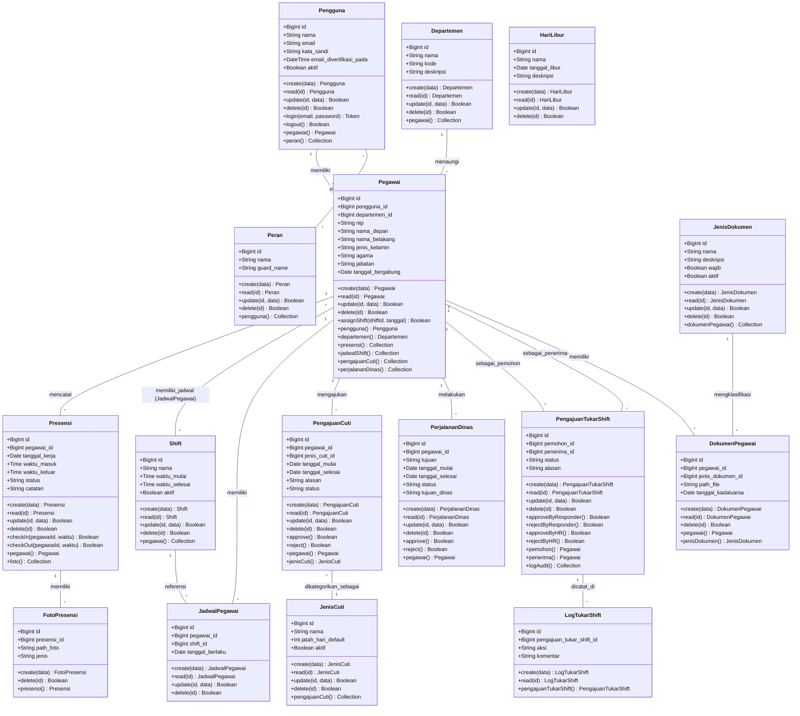

# Class Diagram SIMPEG (Sistem Informasi Kepegawaian)

Berikut adalah representasi *Class Diagram* (berbahasa Indonesia) untuk arsitektur database/model di sistem SIMPEG. Diagram ini sudah mencakup atribut dan metode operasional (Create, Read, Update, Delete) serta operasi bisnis spesifik masing-masing entitas seolah direpresentasikan mulai dari Controller/Service hingga Model.

### Penjelasan Entitas, Relasi & Operasi (Methods)
- **Atribut & Relasi Kardinalitas**: Relasi antar diagram dijabarkan dengan kardinalitas _(One-to-Many, Many-to-Many via pivot, One-to-One)_. 
- **Method CRUD (`create`, `read`, `update`, `delete`)**: Menggambarkan operasi standar untuk membaca, menyimpan, memperbarui, dan menghapus setiap baris *record* database yang pada implementasi nyatanya ditangani oleh Eloquent Model dan Controller.
- **Method Spesifik Bisnis**: Beberapa model sengaja dicantumkan *action methods* tambahan yang dikelola oleh *Controller/Service* spesifik secara logika OOP:
  - `Pengguna`: method `login()` dan `logout()` untuk alur autentikasi.
  - `Pegawai`: method `assignShift()` untuk menjadwalkan shift.
  - `Presensi`: method `checkIn()` dan `checkOut()` mewakili logika pencatatan waktu *scan* kehadiran.
  - `PengajuanCuti`, `PerjalananDinas`, `PengajuanTukarShift`: method *approval* seperti `approve()` (Setujui) dan `reject()` (Tolak). Secara khusus pada *Tukar Shift*, proses persetujuan memiliki hierarki (`approveByResponder`, `approveByHR`).
