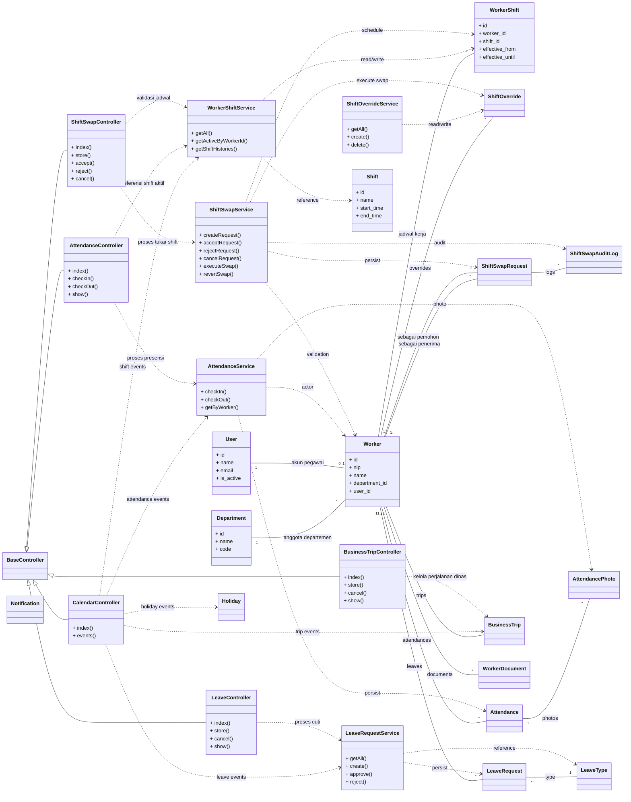

# Class Diagram Versi MVC (SIMPEG)

Diagram ini disusun dengan pendekatan **controller-centric**:
semua alur fitur masuk lewat controller, lalu diteruskan ke service dan model.

Catatan istilah:
- `User` = akun login.
- `Worker` = data pegawai (profil SDM) yang terhubung ke akun.

## Catatan
- Struktur ini menempatkan **controller sebagai pintu masuk utama** untuk semua fitur.
- Jika diperlukan, diagram dapat dipecah lagi per controller (misalnya diagram khusus `ShiftSwapController`).
