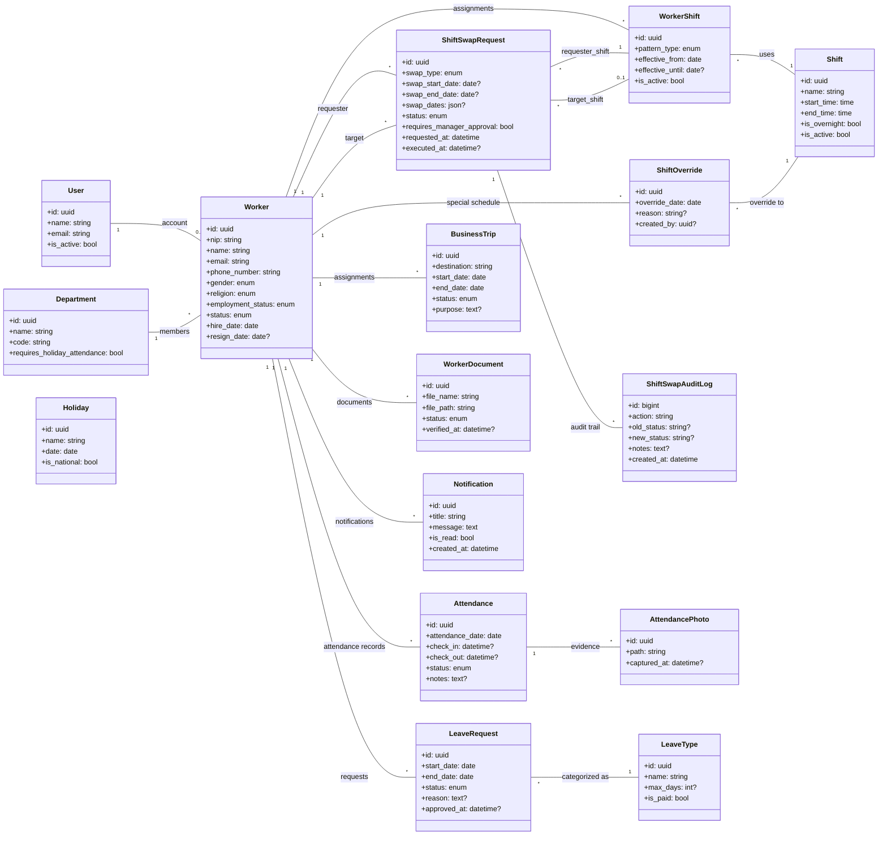

# Class Diagram UML Murni (Domain SIMPEG)

Diagram ini fokus pada **entity domain + atribut inti + relasi kardinalitas**.
Tidak menampilkan Controller/Service atau operasi CRUD generik.

## Catatan
- Ini adalah UML class diagram domain murni.
- Controller, Service, Repository, dan method CRUD sengaja tidak dimasukkan.
- Cocok untuk komunikasi struktur data/relasi bisnis inti.
