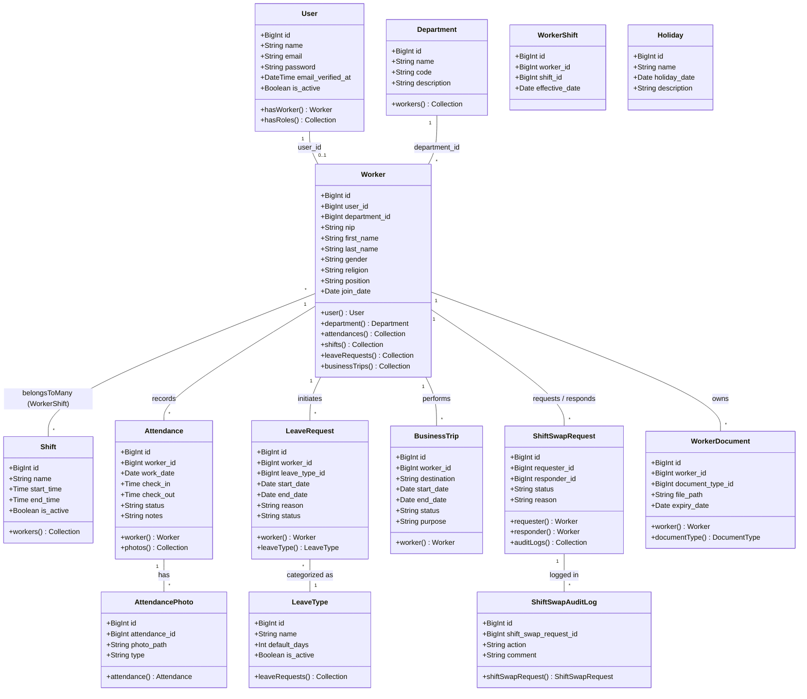

# Class Diagram SIMPEG (Sistem Informasi Kepegawaian)

Berikut adalah *Class Diagram* untuk sistem SIMPEG, yang menggambarkan entitas utama, atribut-atribut penting, serta relasi atau kardinalitas antar entitas dalam database (berdasarkan Model Eloquent Laravel yang ada di sistem ini).

### Penjelasan Entitas & Kardinalitas (Relationship)
- **User & Worker (One-to-One / One-to-Zero)**: Satu akun `User` merepresentasikan maksimal satu data pegawai / `Worker`.
- **Department & Worker (One-to-Many)**: Satu Departemen bisa menaungi banyak pekerja.
- **Worker & Shift (Many-to-Many)**: Diwakili menggunakan tabel pivot / entitas **WorkerShift**.
- **Worker & Attendance (One-to-Many)**: Satu pekerja mencatatkan banyak riwayat kehadiran. Setiap entitas `Attendance` tersebut memiliki foto bukti presensi pada entitas `AttendancePhoto`.
- **Leave Management**: Pekerja mengajukan `LeaveRequest` yang berkategori pada `LeaveType` tertentu.
- **Shift Swap**: Seorang pekerja dapat mengajukan pertukaran jadwal (`ShiftSwapRequest`) dengan pekerja lainnya. Riwayat status pertukaran ini dicatat pada `ShiftSwapAuditLog`.

Note: *Class ini menggambarkan arsitektur core data dari SIMPEG berdasarkan model dan migrasi terbaru tanpa mengikutsertakan model yang sudah tidak digunakan (seperti `ShiftOverride`, `OvertimeRequest`, dan `SalaryComponent`).*
