# Object Diagram SIMPEG (Sistem Informasi Kepegawaian)

Berikut adalah *Object Diagram* yang mengilustrasikan snapshot data nyata pada satu titik waktu di sistem SIMPEG.

```mermaid
classDiagram
    class Departemen_RawatInap {
id = "dpt-001"
nama = "Rawat Inap"
kode = "RI-01"
deskripsi = "Unit pelayanan rawat inap"
aktif = true
wajib_hadir_hari_libur = false
    }

    class Role_Karyawan {
id = 1
nama = "karyawan"
nama_penjaga = "web"
    }

    class Role_HR {
id = 2
nama = "hr"
nama_penjaga = "web"
    }

    class Permission_KelolaPresensi {
id = 11
nama = "kelola presensi"
nama_penjaga = "web"
    }

    class RoleMemilikiPermission_HR_Presensi {
id_Role = 2
id_Permission = 11
    }

    class ModelMemilikiRole_Siti_HR {
id_Role = 2
tipe_model = "App\\Models\\User"
id_model = "usr-002"
    }

    class ModelMemilikiPermission_Siti_Presensi {
id_Permission = 11
tipe_model = "App\\Models\\User"
id_model = "usr-002"
    }

    class TipeCuti_Tahunan {
id = "tc-001"
nama = "Cuti Tahunan"
kode = "CT"
maksimal_hari_per_tahun = 12
perlu_persetujuan = true
perlu_lampiran = false
hari_pemberitahuan = 3
aktif = true
    }

    class TipeDokumen_STR {
id = "td-001"
nama = "STR"
deskripsi = "Surat Tanda Registrasi"
format_file = "pdf,jpg,png"
ukuran_maksimal_file = 2048
wajib = true
universal = false
aktif = true
    }

    class TipeDokumenDepartemen_RawatInap_STR {
id = "tdd-001"
id_departemen = "dpt-001"
id_tipe_dokumen = "td-001"
    }

    class HariLibur_Nasional_17Agustus {
id = "hl-001"
nama = "Hari Kemerdekaan"
tanggal = "2026-08-17"
deskripsi = "Hari libur nasional"
nasional = true
    }

    class Pengguna_Budi {
id = "usr-001"
id_pegawai = "pgw-001"
email = "budi@rs.com"
nama_pengguna = "budi.s"
kata_sandi = "<hash>"
email_terverifikasi_pada = "2026-03-01 08:00:00"
login_terakhir = "2026-04-01 06:40:00"
aktif = true
    }

    class Pengguna_Siti {
id = "usr-002"
id_pegawai = "pgw-002"
email = "siti@rs.com"
nama_pengguna = "siti.a"
kata_sandi = "<hash>"
email_terverifikasi_pada = "2026-03-01 08:10:00"
login_terakhir = "2026-04-01 07:05:00"
aktif = true
    }

    class TokenResetKataSandi_Budi {
email = "budi@rs.com"
token = "<reset-token-hash>"
dibuat_pada = "2026-04-02 07:00:00"
    }

    class Pegawai_Budi {
id = "pgw-001"
nip = "19900101"
nama = "Budi Santoso"
email = "budi.worker@rs.com"
nomor_telepon = "081234567890"
alamat = "Jl. Melati 1"
tanggal_lahir = "1990-01-01"
tempat_lahir = "Bandung"
jenis_kelamin = "laki-laki"
agama = "islam"
id_departemen = "dpt-001"
id_shift = "shf-001"
tanggal_bergabung = "2023-01-10"
status_kepegawaian = "tetap"
status = "aktif"
    }

    class Pegawai_Siti {
id = "pgw-002"
nip = "19920202"
nama = "Siti Aminah"
email = "siti.worker@rs.com"
nomor_telepon = "081298765432"
alamat = "Jl. Mawar 2"
tanggal_lahir = "1992-02-02"
tempat_lahir = "Jakarta"
jenis_kelamin = "perempuan"
agama = "islam"
id_departemen = "dpt-001"
id_shift = "shf-002"
tanggal_bergabung = "2022-07-15"
status_kepegawaian = "tetap"
status = "aktif"
    }

    class Shift_Pagi {
id = "shf-001"
nama = "Shift Pagi"
waktu_mulai = "07:00:00"
waktu_selesai = "15:00:00"
total_jam = 8
menit_toleransi = 10
lintas_hari = false
aktif = true
    }

    class Shift_Siang {
id = "shf-002"
nama = "Shift Siang"
waktu_mulai = "15:00:00"
waktu_selesai = "23:00:00"
total_jam = 8
menit_toleransi = 10
lintas_hari = false
aktif = true
    }

    class HariDalamShift_Senin_Pagi {
id = "hds-001"
id_shift = "shf-001"
hari_dalam_minggu = 1
waktu_mulai = "07:00:00"
waktu_selesai = "15:00:00"
    }

    class HariDalamShift_Senin_Siang {
id = "hds-002"
id_shift = "shf-002"
hari_dalam_minggu = 1
waktu_mulai = "15:00:00"
waktu_selesai = "23:00:00"
    }

    class JadwalShiftPegawai_Budi_01April {
id = "jsp-001"
id_pegawai = "pgw-001"
id_shift = "shf-001"
berlaku_mulai = "2026-04-01"
berlaku_sampai = null
aktif = true
catatan = "Jadwal reguler"
    }

    class JadwalShiftPegawai_Siti_01April {
id = "jsp-002"
id_pegawai = "pgw-002"
id_shift = "shf-002"
berlaku_mulai = "2026-04-01"
berlaku_sampai = null
aktif = true
catatan = "Jadwal reguler"
    }

    class RiwayatShiftPegawai_Budi_Maret {
id = "rsp-001"
id_pegawai = "pgw-001"
id_shift = "shf-002"
berlaku_mulai = "2026-03-01"
berlaku_sampai = "2026-03-31"
diubah_oleh = "usr-002"
alasan = "Penyesuaian sementara unit"
    }

    class HariLiburPegawai_Budi_06April {
id = "hlp-001"
id_pegawai = "pgw-001"
tanggal_libur = "2026-04-06"
catatan = "Libur pengganti"
dibuat_oleh = "usr-002"
    }

    class Kehadiran_Budi_01April {
id = "khd-001"
id_pegawai = "pgw-001"
id_shift = "shf-001"
tanggal_kehadiran = "2026-04-01"
waktu_masuk = "2026-04-01 06:55:00"
waktu_keluar = "2026-04-01 15:02:00"
status = "hadir"
terlambat = false
menit_terlambat = 0
pulang_cepat = false
menit_pulang_cepat = 0
catatan = "Masuk tepat waktu"
    }

    class FotoKehadiran_Budi_01April {
id = "fkh-001"
id_kehadiran = "khd-001"
path_foto = "/storage/attendance/budi-2026-04-01.jpg"
tipe_foto = "masuk"
diambil_pada = "2026-04-01 06:55:03"
    }

    class PengajuanCuti_Siti {
id = "cuti-001"
id_pegawai = "pgw-002"
id_tipe_cuti = "tc-001"
tanggal_mulai = "2026-04-10"
tanggal_selesai = "2026-04-12"
total_hari = 3
alasan = "Keperluan keluarga"
status = "disetujui"
disetujui_oleh = "usr-002"
disetujui_pada = "2026-04-05 09:00:00"
    }

    class PerjalananDinas_Budi {
id = "pd-001"
id_pegawai = "pgw-001"
tujuan = "Bandung"
keperluan = "Pelatihan akreditasi"
tanggal_mulai = "2026-04-20"
tanggal_selesai = "2026-04-22"
tipe_durasi = "penuh"
transportasi = "Kereta"
akomodasi = "Hotel"
status = "disetujui"
disetujui_oleh = "usr-002"
disetujui_pada = "2026-04-12 10:30:00"
    }

    class PengajuanTukarShift_Budi_Siti {
id = "pts-001"
id_pemohon = "pgw-001"
id_penerima = "pgw-002"
id_shift_pemohon = "jsp-001"
id_shift_penerima = "jsp-002"
tipe_tukar = "satu_hari"
tanggal_tukar_mulai = "2026-04-15"
tanggal_tukar_selesai = "2026-04-15"
status = "disetujui"
perlu_persetujuan_manajer = false
alasan = "Ada acara keluarga mendadak"
diminta_pada = "2026-04-08 08:00:00"
dieksekusi_oleh = "usr-002"
dieksekusi_pada = "2026-04-09 09:00:00"
    }

    class PenyesuaianShift_Budi_15April {
id = "ps-001"
id_pegawai = "pgw-001"
id_shift = "shf-002"
tanggal_penyesuaian = "2026-04-15"
alasan = "Menjalankan hasil tukar shift"
dibuat_oleh = "usr-002"
id_pengajuan_tukar_shift = "pts-001"
    }

    class AuditPengajuanTukarShift_1 {
id = "apts-001"
id_pengajuan_tukar_shift = "pts-001"
id_pengguna = "usr-002"
aksi = "setujui_oleh_penerima"
status_lama = "menunggu"
status_baru = "disetujui_penerima"
catatan = "Disetujui oleh Siti"
    }

    class AuditPengajuanTukarShift_2 {
id = "apts-002"
id_pengajuan_tukar_shift = "pts-001"
id_pengguna = "usr-002"
aksi = "setujui_oleh_hr"
status_lama = "disetujui_penerima"
status_baru = "disetujui"
catatan = "Disetujui HR"
    }

    class DokumenPegawai_Budi_STR {
id = "dok-001"
id_pegawai = "pgw-001"
id_tipe_dokumen = "td-001"
id_tipe_dokumen_departemen = "tdd-001"
nama_file = "str-budi.pdf"
path_file = "/storage/documents/str-budi.pdf"
ukuran_file = 450000
tanggal_kedaluwarsa = "2027-12-31"
status = "terverifikasi"
diverifikasi_oleh = "usr-002"
diverifikasi_pada = "2026-04-03 13:00:00"
    }

    Pengguna_Budi -- Pegawai_Budi : memiliki profil pegawai
    Pengguna_Siti -- Pegawai_Siti : memiliki profil pegawai
    Pengguna_Budi -- TokenResetKataSandi_Budi : reset kata sandi

    Pengguna_Budi -- Role_Karyawan : memiliki Role
    Pengguna_Siti -- Role_Karyawan : memiliki Role
    Pengguna_Siti -- Role_HR : memiliki Role
    Role_HR -- RoleMemilikiPermission_HR_Presensi : role has permission
    Permission_KelolaPresensi -- RoleMemilikiPermission_HR_Presensi : role has permission
    Role_HR -- ModelMemilikiRole_Siti_HR : model has role
    Permission_KelolaPresensi -- ModelMemilikiPermission_Siti_Presensi : model has permission

    Departemen_RawatInap -- Pegawai_Budi : memiliki anggota
    Departemen_RawatInap -- Pegawai_Siti : memiliki anggota
    Departemen_RawatInap -- TipeDokumenDepartemen_RawatInap_STR : aturan dokumen
    TipeDokumen_STR -- TipeDokumenDepartemen_RawatInap_STR : aturan dokumen

    Pegawai_Budi -- JadwalShiftPegawai_Budi_01April : jadwal shift pegawai
    Pegawai_Siti -- JadwalShiftPegawai_Siti_01April : jadwal shift pegawai
    Shift_Pagi -- JadwalShiftPegawai_Budi_01April : referensi shift
    Shift_Siang -- JadwalShiftPegawai_Siti_01April : referensi shift

    Shift_Pagi -- HariDalamShift_Senin_Pagi : hari dalam shift
    Shift_Siang -- HariDalamShift_Senin_Siang : hari dalam shift
    Pegawai_Budi -- RiwayatShiftPegawai_Budi_Maret : riwayat shift pegawai
    Shift_Siang -- RiwayatShiftPegawai_Budi_Maret : referensi riwayat shift
    Pegawai_Budi -- PenyesuaianShift_Budi_15April : penyesuaian shift
    Shift_Siang -- PenyesuaianShift_Budi_15April : shift penyesuaian
    Pegawai_Budi -- HariLiburPegawai_Budi_06April : hari libur pegawai

    Pegawai_Budi -- Kehadiran_Budi_01April : kehadiran
    Kehadiran_Budi_01April -- FotoKehadiran_Budi_01April : foto kehadiran

    Pegawai_Siti -- PengajuanCuti_Siti : pengajuan cuti
    PengajuanCuti_Siti -- TipeCuti_Tahunan : tipe cuti

    Pegawai_Budi -- PerjalananDinas_Budi : perjalanan dinas

    Pegawai_Budi -- PengajuanTukarShift_Budi_Siti : sebagai pemohon
    Pegawai_Siti -- PengajuanTukarShift_Budi_Siti : sebagai penerima
    PengajuanTukarShift_Budi_Siti -- AuditPengajuanTukarShift_1 : audit pengajuan tukar shift
    PengajuanTukarShift_Budi_Siti -- AuditPengajuanTukarShift_2 : audit pengajuan tukar shift

    Pegawai_Budi -- DokumenPegawai_Budi_STR : dokumen pegawai
    TipeDokumen_STR -- DokumenPegawai_Budi_STR : tipe dokumen
```

### Penjelasan Singkat
1. Diagram ini menampilkan data contoh untuk semua entitas utama dan entitas pendukung yang Anda minta.
2. Istilah isi sudah diubah ke bahasa Indonesia, termasuk nama atribut dan label relasi.
3. Entitas yang sudah ada tetap dipertahankan, hanya disesuaikan penamaannya.
