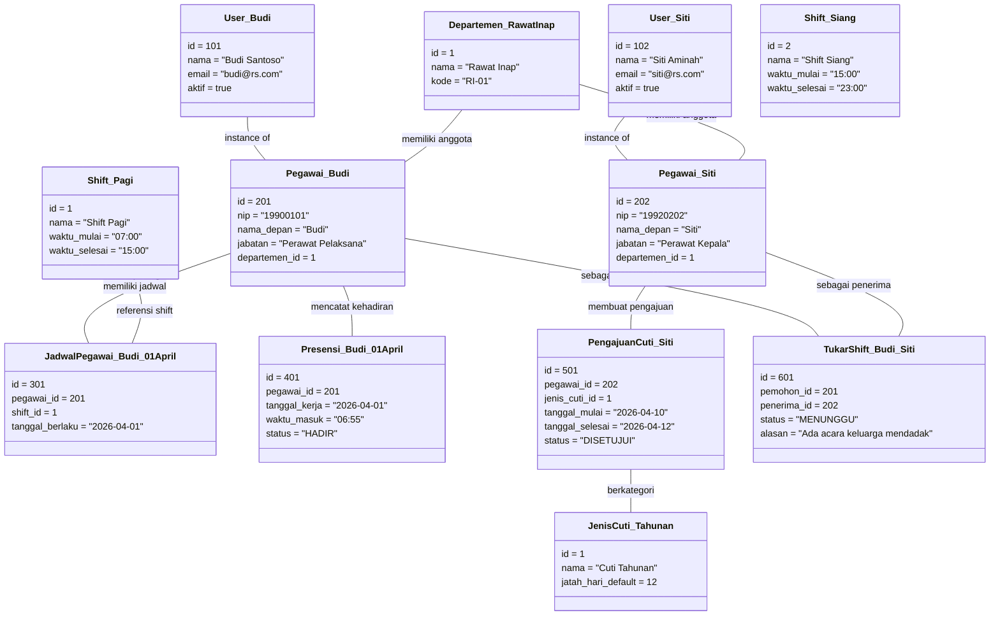

# Object Diagram SIMPEG (Sistem Informasi Kepegawaian)

Berikut adalah *Object Diagram* yang mengilustrasikan keadaan *real* (instansiasi objek beserta contoh data/nilai atributnya) dari sistem SIMPEG pada suatu titik waktu tertentu. 

Diagram ini menggambarkan skenario nyata di mana dua orang pegawai (Budi dan Siti) berada di departemen yang sama, memiliki catatan presensi, pengajuan cuti, dan alur permintaan tukar shift.

### Penjelasan Skenario Object Diagram
Berdasarkan Class Diagram sebelumnya, pada Object Diagram di atas digambarkan suatu snapshot data saat sistem berjalan:
1. **Pekerja & Departemen**: Terdapat dua objek pegawai (Budi & Siti) yang sama-sama tergabung dalam satu departemen (Departemen Rawat Inap). Keduanya juga terhubung langsung dengan Akun Pengguna (`User_Budi`, `User_Siti`).
2. **Jadwal & Shift**: Budi memiliki relasi pivot jadwal masuk (`JadwalPegawai_Budi_01April`) yang mengarah padanya dan `Shift_Pagi`.
3. **Presensi**: Budi melakukan check-in tepat waktu pukul 06:55 dan membuat objek presensi (`Presensi_Budi_01April`) dengan status HADIR.
4. **Cuti**: Siti mengajukan sebuah Cuti (`PengajuanCuti_Siti`) terkait jenis Cuti Tahunan (`JenisCuti_Tahunan`) yang saat ini berstatus DISETUJUI.
5. **Tukar Shift**: Budi ingin bertukar shift dengan Siti dengan alasan acara keluarga, dan menghasilkan record obyek (`TukarShift_Budi_Siti`) dengan status saat ini MENUNGGU persetujuan dari Siti / HR.
