# Diagram Use Case - Sistem SIMPEG

## Use Case dengan Extended Relationships & Akses Berbasis Permission

```mermaid
graph TB
    subgraph System ["Sistem Informasi Manajemen Pegawai (SIMPEG)"]
        subgraph DeptMgmt["Kelola Departemen"]
            CreateDept["Buat Departemen"]
            ReadDept["Lihat Departemen"]
            UpdateDept["Ubah Departemen"]
            DeleteDept["Hapus Departemen"]
        end
        
        subgraph ShiftMgmt["Kelola Shift"]
            CreateShift["Buat Shift"]
            ReadShift["Lihat Shift"]
            UpdateShift["Ubah Shift"]
            DeleteShift["Hapus Shift"]
        end
        
        subgraph LeaveMgmt["Kelola Jenis Cuti"]
            CreateLeave["Buat Jenis Cuti"]
            ReadLeave["Lihat Jenis Cuti"]
            UpdateLeave["Ubah Jenis Cuti"]
            DeleteLeave["Hapus Jenis Cuti"]
        end
        
        subgraph AttendanceMgmt["Kelola Absensi"]
            CheckInEmployee["Check-In Pegawai"]
            CheckOutEmployee["Check-Out Pegawai"]
            CheckInAdmin["Check-In oleh Admin"]
            CheckOutAdmin["Check-Out oleh Admin"]
            DetailAttendance["Lihat Detail Absensi"]
            ExportAttendance["Ekspor Absensi"]
        end
        
        subgraph LeaveReqMgmt["Kelola Permintaan Cuti"]
            SubmitLeaveReq["Ajukan Permintaan Cuti"]
            ApproveLeaveReq["Setujui Permintaan Cuti"]
            RejectLeaveReq["Tolak Permintaan Cuti"]
            DetailLeaveReq["Lihat Detail Permintaan Cuti"]
        end
        
        subgraph ShiftSwapMgmt["Kelola Tukar Shift"]
            SubmitShiftSwap["Ajukan Tukar Shift"]
            ApproveShiftSwap["Setujui Tukar Shift"]
            RejectShiftSwap["Tolak Tukar Shift"]
            DetailShiftSwap["Lihat Detail Tukar Shift"]
        end
        
        subgraph OvertimeMgmt["Kelola Lembur"]
            SubmitOvertime["Ajukan Permintaan Lembur"]
            ApproveOvertime["Setujui Permintaan Lembur"]
            DetailOvertime["Lihat Detail Lembur"]
            ExportOvertime["Ekspor Data Lembur"]
        end
        
        subgraph DocumentMgmt["Kelola Dokumen"]
            SubmitDocument["Kirim Dokumen"]
            VerifyDocument["Verifikasi Dokumen"]
            DetailDocument["Lihat Detail Dokumen"]
            DeleteDocument["Hapus Dokumen"]
        end
        
        subgraph ReportMgmt["Buat Laporan"]
            AttendanceReport["Laporan Absensi"]
            LeaveReport["Laporan Cuti"]
            OvertimeReport["Laporan Lembur"]
            SalaryReport["Laporan Gaji"]
        end
        
        subgraph UserMgmt["Kelola Pengguna"]
            CreateUser["Buat Pengguna"]
            ReadUser["Lihat Pengguna"]
            UpdateUser["Ubah Pengguna"]
            DeactivateUser["Nonaktifkan Pengguna"]
            ResetPassword["Reset Password"]
            AssignRole["Tetapkan Role"]
        end
        
        subgraph SystemConfig["Konfigurasi Sistem"]
            ManageHolidays["Kelola Hari Libur"]
            ManageSalaryComponent["Kelola Komponen Gaji"]
            ViewAuditLog["Lihat Log Audit"]
            SystemSettings["Pengaturan Sistem"]
        end
    end
    
    Pegawai["👤 Pegawai"]
    Manager["👔 Manager (Atasan)"]
    HR["💼 HR Admin"]
    Admin["🔧 Admin Sistem"]
    
    %% ========== PEGAWAI PERMISSIONS ==========
    Pegawai -->|akses| CheckInEmployee
    Pegawai -->|akses| CheckOutEmployee
    Pegawai -->|akses| SubmitLeaveReq
    Pegawai -->|akses| DetailLeaveReq
    Pegawai -->|akses| SubmitShiftSwap
    Pegawai -->|akses| DetailShiftSwap
    Pegawai -->|akses| SubmitOvertime
    Pegawai -->|akses| DetailAttendance
    Pegawai -->|akses| SubmitDocument
    Pegawai -->|akses| DetailDocument
    
    %% ========== MANAGER PERMISSIONS ==========
    Manager -->|akses| DetailAttendance
    Manager -->|akses| ExportAttendance
    Manager -->|akses| DetailLeaveReq
    Manager -->|akses| ApproveLeaveReq
    Manager -->|akses| RejectLeaveReq
    Manager -->|akses| DetailShiftSwap
    Manager -->|akses| ApproveShiftSwap
    Manager -->|akses| RejectShiftSwap
    Manager -->|akses| DetailOvertime
    Manager -->|akses| ReadDept
    Manager -->|akses| ReadShift
    
    %% ========== HR PERMISSIONS ==========
    HR -->|akses-penuh| DeptMgmt
    HR -->|akses-penuh| ShiftMgmt
    HR -->|akses-penuh| LeaveMgmt
    HR -->|akses-penuh| AttendanceMgmt
    HR -->|akses-penuh| LeaveReqMgmt
    HR -->|akses-penuh| OvertimeMgmt
    HR -->|akses-penuh| DocumentMgmt
    HR -->|akses-penuh| ReportMgmt
    HR -->|akses| ManageHolidays
    HR -->|akses| ManageSalaryComponent
    HR -->|akses| ViewAuditLog
    
    %% ========== ADMIN PERMISSIONS ==========
    Admin -->|akses-penuh| DeptMgmt
    Admin -->|akses-penuh| ShiftMgmt
    Admin -->|akses-penuh| LeaveMgmt
    Admin -->|akses-penuh| SystemConfig
    Admin -->|akses-penuh| UserMgmt
    Admin -->|akses| ViewAuditLog
    Admin -->|akses| AttendanceMgmt
    
    %% ========== EXTEND RELATIONSHIPS ==========
    %% Department Management
    DeptMgmt -->|extend| CreateDept
    DeptMgmt -->|extend| ReadDept
    DeptMgmt -->|extend| UpdateDept
    DeptMgmt -->|extend| DeleteDept
    
    %% Shift Management
    ShiftMgmt -->|extend| CreateShift
    ShiftMgmt -->|extend| ReadShift
    ShiftMgmt -->|extend| UpdateShift
    ShiftMgmt -->|extend| DeleteShift
    
    %% Leave Type Management
    LeaveMgmt -->|extend| CreateLeave
    LeaveMgmt -->|extend| ReadLeave
    LeaveMgmt -->|extend| UpdateLeave
    LeaveMgmt -->|extend| DeleteLeave
    
    %% Attendance Management
    AttendanceMgmt -->|extend| CheckInEmployee
    AttendanceMgmt -->|extend| CheckOutEmployee
    AttendanceMgmt -->|extend| CheckInAdmin
    AttendanceMgmt -->|extend| CheckOutAdmin
    AttendanceMgmt -->|extend| DetailAttendance
    AttendanceMgmt -->|extend| ExportAttendance
    
    %% Leave Request Management
    LeaveReqMgmt -->|extend| SubmitLeaveReq
    LeaveReqMgmt -->|extend| ApproveLeaveReq
    LeaveReqMgmt -->|extend| RejectLeaveReq
    LeaveReqMgmt -->|extend| DetailLeaveReq
    
    %% Shift Swap Management
    ShiftSwapMgmt -->|extend| SubmitShiftSwap
    ShiftSwapMgmt -->|extend| ApproveShiftSwap
    ShiftSwapMgmt -->|extend| RejectShiftSwap
    ShiftSwapMgmt -->|extend| DetailShiftSwap
    
    %% Overtime Management
    OvertimeMgmt -->|extend| SubmitOvertime
    OvertimeMgmt -->|extend| ApproveOvertime
    OvertimeMgmt -->|extend| DetailOvertime
    OvertimeMgmt -->|extend| ExportOvertime
    
    %% Document Management
    DocumentMgmt -->|extend| SubmitDocument
    DocumentMgmt -->|extend| VerifyDocument
    DocumentMgmt -->|extend| DetailDocument
    DocumentMgmt -->|extend| DeleteDocument
    
    %% Report Management
    ReportMgmt -->|extend| AttendanceReport
    ReportMgmt -->|extend| LeaveReport
    ReportMgmt -->|extend| OvertimeReport
    ReportMgmt -->|extend| SalaryReport
    
    %% User Management
    UserMgmt -->|extend| CreateUser
    UserMgmt -->|extend| ReadUser
    UserMgmt -->|extend| UpdateUser
    UserMgmt -->|extend| DeactivateUser
    UserMgmt -->|extend| ResetPassword
    UserMgmt -->|extend| AssignRole
    
    %% System Config
    SystemConfig -->|extend| ManageHolidays
    SystemConfig -->|extend| ManageSalaryComponent
    SystemConfig -->|extend| ViewAuditLog
    SystemConfig -->|extend| SystemSettings
    
    style Pegawai fill:#e1f5ff,stroke:#01579b,stroke-width:3px
    style Manager fill:#fff3e0,stroke:#e65100,stroke-width:3px
    style HR fill:#f3e5f5,stroke:#4a148c,stroke-width:3px
    style Admin fill:#ffebee,stroke:#b71c1c,stroke-width:3px
    
    style DeptMgmt fill:#f5f5f5
    style ShiftMgmt fill:#f5f5f5
    style LeaveMgmt fill:#f5f5f5
    style AttendanceMgmt fill:#f5f5f5
    style LeaveReqMgmt fill:#f5f5f5
    style ShiftSwapMgmt fill:#f5f5f5
    style OvertimeMgmt fill:#f5f5f5
    style DocumentMgmt fill:#f5f5f5
    style ReportMgmt fill:#f5f5f5
    style UserMgmt fill:#f5f5f5
    style SystemConfig fill:#f5f5f5
```



## Matriks Akses Per Module dan Role

| **Module** | **Use Case** | **Pegawai** | **Manager** | **HR** | **Admin** |
|-----------|------------|-----------|-----------|--------|----------|
| **Departemen** | Buat | ❌ | ❌ | ✅ | ✅ |
| | Lihat | ❌ | ✅ | ✅ | ✅ |
| | Ubah | ❌ | ❌ | ✅ | ✅ |
| | Hapus | ❌ | ❌ | ✅ | ✅ |
| **Kelola Shift** | Buat | ❌ | ❌ | ✅ | ✅ |
| | Lihat | ✅ | ✅ | ✅ | ✅ |
| | Ubah | ❌ | ❌ | ✅ | ✅ |
| | Hapus | ❌ | ❌ | ✅ | ✅ |
| **Jenis Cuti** | Buat | ❌ | ❌ | ✅ | ✅ |
| | Lihat | ✅ | ✅ | ✅ | ✅ |
| | Ubah | ❌ | ❌ | ✅ | ✅ |
| | Hapus | ❌ | ❌ | ✅ | ✅ |
| **Absensi** | Check-In (Diri Sendiri) | ✅ | ❌ | ❌ | ❌ |
| | Check-Out (Diri Sendiri) | ✅ | ❌ | ❌ | ❌ |
| | Check-In (Admin) | ❌ | ❌ | ✅ | ✅ |
| | Check-Out (Admin) | ❌ | ❌ | ✅ | ✅ |
| | Lihat Detail | ✅* | ✅** | ✅ | ✅ |
| | Ekspor | ❌ | ✅ | ✅ | ✅ |
| **Permintaan Cuti** | Ajukan | ✅ | ❌ | ❌ | ❌ |
| | Setujui | ❌ | ✅ | ✅ | ❌ |
| | Tolak | ❌ | ✅ | ✅ | ❌ |
| | Lihat Detail | ✅* | ✅** | ✅ | ❌ |
| **Tukar Shift** | Ajukan | ✅ | ❌ | ❌ | ❌ |
| | Setujui | ❌ | ✅ | ✅ | ❌ |
| | Tolak | ❌ | ✅ | ✅ | ❌ |
| | Lihat Detail | ✅* | ✅** | ✅ | ❌ |
| **Lembur** | Ajukan | ✅ | ❌ | ❌ | ❌ |
| | Setujui | ❌ | ❌ | ✅ | ❌ |
| | Lihat Detail | ✅* | ✅** | ✅ | ❌ |
| | Ekspor | ❌ | ✅ | ✅ | ❌ |
| **Dokumen** | Kirim | ✅ | ❌ | ❌ | ❌ |
| | Verifikasi | ❌ | ❌ | ✅ | ❌ |
| | Lihat Detail | ✅* | ❌ | ✅ | ❌ |
| | Hapus | ❌ | ❌ | ✅ | ✅ |
| **Laporan** | Buat Laporan | ❌ | ❌ | ✅ | ✅ |
| **Pengguna** | Buat | ❌ | ❌ | ❌ | ✅ |
| | Lihat | ❌ | ❌ | ❌ | ✅ |
| | Ubah | ❌ | ❌ | ❌ | ✅ |
| | Nonaktifkan | ❌ | ❌ | ❌ | ✅ |
| | Reset Password | ❌ | ❌ | ❌ | ✅ |
| | Tetapkan Role | ❌ | ❌ | ❌ | ✅ |
| **Sistem** | Kelola Hari Libur | ❌ | ❌ | ✅ | ✅ |
| | Kelola Komponen Gaji | ❌ | ❌ | ✅ | ✅ |
| | Lihat Log Audit | ❌ | ❌ | ✅ | ✅ |
| | Pengaturan Sistem | ❌ | ❌ | ❌ | ✅ |

**Keterangan:**
- ✅ = Akses Penuh
- ❌ = Tidak Ada Akses
- ✅* = Data Diri Sendiri Saja
- ✅** = Data Tim/Bawahan Saja

## Alur Use Case Per Module

### 1. **Kelola Absensi**
```
Pegawai:
  - Check-In (Pagi) → Sistem mencatat waktu & lokasi
  - Check-Out (Sore) → Sistem mencatat waktu & lokasi
  - Lihat Detail Absensi → Melihat riwayat absensi pribadi

Manager:
  - Lihat Detail Absensi → Melihat absensi tim
  - Ekspor Absensi → Menghasilkan laporan absensi tim
  
Admin/HR:
  - Check-In oleh Admin → Input manual jika pegawai tidak bisa check-in
  - Check-Out oleh Admin → Input manual jika pegawai tidak bisa check-out
  - Ekspor Absensi → Ekspor massal untuk penggajian
```

### 2. **Kelola Permintaan Cuti**
```
Pegawai:
  - Ajukan Permintaan Cuti → Pilih jenis, tanggal, alasan
  - Lihat Detail Permintaan Cuti → Lacak status (Menunggu/Disetujui/Ditolak)

Manager:
  - Lihat Detail Permintaan Cuti → Melihat permintaan tim
  - Setujui Permintaan Cuti → Mengubah status menjadi Disetujui
  - Tolak Permintaan Cuti → Mengubah status menjadi Ditolak dengan alasan

HR:
  - Kontrol penuh atas semua permintaan cuti
  - Dapat menolak keputusan manager
```

### 3. **Kelola Departemen**
```
HR:
  - Buat Departemen → Tambah dept baru dengan nama, kode, kepala
  - Lihat Departemen → Daftar semua departemen
  - Ubah Departemen → Modifikasi detail dept
  - Hapus Departemen → Arsipkan atau soft delete

Admin:
  - Sama seperti HR (akses penuh)
```

### 4. **Kelola Tukar Shift**
```
Pegawai:
  - Ajukan Tukar Shift → Minta tukar dengan pegawai lain
  - Lihat Detail Tukar Shift → Lacak status permintaan tukar

Manager:
  - Lihat Detail Tukar Shift → Lihat permintaan tukar tim
  - Setujui Tukar Shift → Validasi dan setujui
  - Tolak Tukar Shift → Tolak dengan alasan

HR:
  - Oversight penuh dan kemampuan override
```

### 5. **Kelola Lembur**
```
Pegawai:
  - Ajukan Permintaan Lembur → Ajukan dengan tanggal, jam, alasan

Manager:
  - Lihat Detail Lembur → Lihat permintaan lembur tim
  - Ekspor Lembur → Report lembur tim

HR/Admin:
  - Setujui Permintaan Lembur → Proses persetujuan
  - Lihat Detail Lembur → Akses penuh
  - Ekspor Lembur → Ekspor untuk payroll
```

### 6. **Kelola Dokumen**
```
Pegawai:
  - Kirim Dokumen → Upload dokumen (SK, sertifikat, dll)
  - Lihat Detail Dokumen → Lihat status verifikasi

HR:
  - Verifikasi Dokumen → Review dan validasi dokumen
  - Lihat Detail Dokumen → Akses semua dokumen
  - Hapus Dokumen → Hapus dokumen jika perlu

Admin:
  - Sama seperti HR
```

### 7. **Kelola Pengguna**
```
Admin (Hanya Admin):
  - Buat Pengguna → Daftar pengguna baru
  - Lihat Pengguna → Daftar semua pengguna
  - Ubah Pengguna → Modifikasi data pengguna
  - Nonaktifkan Pengguna → Deaktivasi akun
  - Reset Password → Reset password pengguna
  - Tetapkan Role → Assign role/permission
```

### 8. **Buat Laporan**
```
HR/Admin:
  - Laporan Absensi → Generate laporan kehadiran pegawai
  - Laporan Cuti → Generate laporan penggunaan cuti
  - Laporan Lembur → Generate laporan lembur kerja
  - Laporan Gaji → Generate laporan komponen gaji
```
