# Use Case Diagram - SIMPEG System

## Use Case dengan Extended Relationships & Permission-Based Access

```mermaid
graph TB
    subgraph System ["Sistem Informasi Manajemen Pegawai (SIMPEG)"]
        subgraph DeptMgmt["Manage Department"]
            CreateDept["Create Department"]
            ReadDept["Read Department"]
            UpdateDept["Update Department"]
            DeleteDept["Delete Department"]
        end
        
        subgraph ShiftMgmt["Manage Shift"]
            CreateShift["Create Shift"]
            ReadShift["Read Shift"]
            UpdateShift["Update Shift"]
            DeleteShift["Delete Shift"]
        end
        
        subgraph LeaveMgmt["Manage Leave Type"]
            CreateLeave["Create Leave Type"]
            ReadLeave["Read Leave Type"]
            UpdateLeave["Update Leave Type"]
            DeleteLeave["Delete Leave Type"]
        end
        
        subgraph AttendanceMgmt["Manage Attendance"]
            CheckInEmployee["Check-In Employee"]
            CheckOutEmployee["Check-Out Employee"]
            CheckInAdmin["Check-In by Admin"]
            CheckOutAdmin["Check-Out by Admin"]
            DetailAttendance["View Detail Attendance"]
            ExportAttendance["Export Attendance"]
        end
        
        subgraph LeaveReqMgmt["Manage Leave Request"]
            SubmitLeaveReq["Submit Leave Request"]
            ApproveLeaveReq["Approve Leave Request"]
            RejectLeaveReq["Reject Leave Request"]
            DetailLeaveReq["View Detail Leave Request"]
        end
        
        subgraph ShiftSwapMgmt["Manage Shift Swap"]
            SubmitShiftSwap["Submit Shift Swap"]
            ApproveShiftSwap["Approve Shift Swap"]
            RejectShiftSwap["Reject Shift Swap"]
            DetailShiftSwap["View Detail Shift Swap"]
        end
        
        subgraph OvertimeMgmt["Manage Overtime"]
            SubmitOvertime["Submit Overtime Request"]
            ApproveOvertime["Approve Overtime Request"]
            DetailOvertime["View Detail Overtime"]
            ExportOvertime["Export Overtime Data"]
        end
        
        subgraph DocumentMgmt["Manage Documents"]
            SubmitDocument["Submit Document"]
            VerifyDocument["Verify Document"]
            DetailDocument["View Detail Document"]
            DeleteDocument["Delete Document"]
        end
        
        subgraph ReportMgmt["Generate Reports"]
            AttendanceReport["Attendance Report"]
            LeaveReport["Leave Report"]
            OvertimeReport["Overtime Report"]
            SalaryReport["Salary Report"]
        end
        
        subgraph UserMgmt["Manage Users"]
            CreateUser["Create User"]
            ReadUser["Read User"]
            UpdateUser["Update User"]
            DeactivateUser["Deactivate User"]
            ResetPassword["Reset Password"]
            AssignRole["Assign Role"]
        end
        
        subgraph SystemConfig["Configure System"]
            ManageHolidays["Manage Holidays"]
            ManageSalaryComponent["Manage Salary Component"]
            ViewAuditLog["View Audit Log"]
            SystemSettings["System Settings"]
        end
    end
    
    Pegawai["👤 Pegawai (Employee)"]
    Manager["👔 Manager (Atasan)"]
    HR["💼 HR Admin"]
    Admin["🔧 Admin Sistem"]
    
    %% ========== PEGAWAI PERMISSIONS ==========
    Pegawai -->|access| CheckInEmployee
    Pegawai -->|access| CheckOutEmployee
    Pegawai -->|access| SubmitLeaveReq
    Pegawai -->|access| DetailLeaveReq
    Pegawai -->|access| SubmitShiftSwap
    Pegawai -->|access| DetailShiftSwap
    Pegawai -->|access| SubmitOvertime
    Pegawai -->|access| DetailAttendance
    Pegawai -->|access| SubmitDocument
    Pegawai -->|access| DetailDocument
    
    %% ========== MANAGER PERMISSIONS ==========
    Manager -->|access| DetailAttendance
    Manager -->|access| ExportAttendance
    Manager -->|access| DetailLeaveReq
    Manager -->|access| ApproveLeaveReq
    Manager -->|access| RejectLeaveReq
    Manager -->|access| DetailShiftSwap
    Manager -->|access| ApproveShiftSwap
    Manager -->|access| RejectShiftSwap
    Manager -->|access| DetailOvertime
    Manager -->|access| ReadDept
    Manager -->|access| ReadShift
    
    %% ========== HR PERMISSIONS ==========
    HR -->|full-access| DeptMgmt
    HR -->|full-access| ShiftMgmt
    HR -->|full-access| LeaveMgmt
    HR -->|full-access| AttendanceMgmt
    HR -->|full-access| LeaveReqMgmt
    HR -->|full-access| OvertimeMgmt
    HR -->|full-access| DocumentMgmt
    HR -->|full-access| ReportMgmt
    HR -->|access| ManageHolidays
    HR -->|access| ManageSalaryComponent
    HR -->|access| ViewAuditLog
    
    %% ========== ADMIN PERMISSIONS ==========
    Admin -->|full-access| DeptMgmt
    Admin -->|full-access| ShiftMgmt
    Admin -->|full-access| LeaveMgmt
    Admin -->|full-access| SystemConfig
    Admin -->|full-access| UserMgmt
    Admin -->|access| ViewAuditLog
    Admin -->|access| AttendanceMgmt
    
    %% ========== EXTEND RELATIONSHIPS ==========
    %% Department Management
    DeptMgmt -->|extend| CreateDept
    DeptMgmt -->|extend| ReadDept
    DeptMgmt -->|extend| UpdateDept
    DeptMgmt -->|extend| DeleteDept
    
    %% Shift Management
    ShiftMgmt -->|extend| CreateShift
    ShiftMgmt -->|extend| ReadShift
    ShiftMgmt -->|extend| UpdateShift
    ShiftMgmt -->|extend| DeleteShift
    
    %% Leave Type Management
    LeaveMgmt -->|extend| CreateLeave
    LeaveMgmt -->|extend| ReadLeave
    LeaveMgmt -->|extend| UpdateLeave
    LeaveMgmt -->|extend| DeleteLeave
    
    %% Attendance Management
    AttendanceMgmt -->|extend| CheckInEmployee
    AttendanceMgmt -->|extend| CheckOutEmployee
    AttendanceMgmt -->|extend| CheckInAdmin
    AttendanceMgmt -->|extend| CheckOutAdmin
    AttendanceMgmt -->|extend| DetailAttendance
    AttendanceMgmt -->|extend| ExportAttendance
    
    %% Leave Request Management
    LeaveReqMgmt -->|extend| SubmitLeaveReq
    LeaveReqMgmt -->|extend| ApproveLeaveReq
    LeaveReqMgmt -->|extend| RejectLeaveReq
    LeaveReqMgmt -->|extend| DetailLeaveReq
    
    %% Shift Swap Management
    ShiftSwapMgmt -->|extend| SubmitShiftSwap
    ShiftSwapMgmt -->|extend| ApproveShiftSwap
    ShiftSwapMgmt -->|extend| RejectShiftSwap
    ShiftSwapMgmt -->|extend| DetailShiftSwap
    
    %% Overtime Management
    OvertimeMgmt -->|extend| SubmitOvertime
    OvertimeMgmt -->|extend| ApproveOvertime
    OvertimeMgmt -->|extend| DetailOvertime
    OvertimeMgmt -->|extend| ExportOvertime
    
    %% Document Management
    DocumentMgmt -->|extend| SubmitDocument
    DocumentMgmt -->|extend| VerifyDocument
    DocumentMgmt -->|extend| DetailDocument
    DocumentMgmt -->|extend| DeleteDocument
    
    %% Report Management
    ReportMgmt -->|extend| AttendanceReport
    ReportMgmt -->|extend| LeaveReport
    ReportMgmt -->|extend| OvertimeReport
    ReportMgmt -->|extend| SalaryReport
    
    %% User Management
    UserMgmt -->|extend| CreateUser
    UserMgmt -->|extend| ReadUser
    UserMgmt -->|extend| UpdateUser
    UserMgmt -->|extend| DeactivateUser
    UserMgmt -->|extend| ResetPassword
    UserMgmt -->|extend| AssignRole
    
    %% System Config
    SystemConfig -->|extend| ManageHolidays
    SystemConfig -->|extend| ManageSalaryComponent
    SystemConfig -->|extend| ViewAuditLog
    SystemConfig -->|extend| SystemSettings
    
    style Pegawai fill:#e1f5ff,stroke:#01579b,stroke-width:3px
    style Manager fill:#fff3e0,stroke:#e65100,stroke-width:3px
    style HR fill:#f3e5f5,stroke:#4a148c,stroke-width:3px
    style Admin fill:#ffebee,stroke:#b71c1c,stroke-width:3px
    
    style DeptMgmt fill:#f5f5f5
    style ShiftMgmt fill:#f5f5f5
    style LeaveMgmt fill:#f5f5f5
    style AttendanceMgmt fill:#f5f5f5
    style LeaveReqMgmt fill:#f5f5f5
    style ShiftSwapMgmt fill:#f5f5f5
    style OvertimeMgmt fill:#f5f5f5
    style DocumentMgmt fill:#f5f5f5
    style ReportMgmt fill:#f5f5f5
    style UserMgmt fill:#f5f5f5
    style SystemConfig fill:#f5f5f5
```



## Detailed Permission Matrix by Role

| **Module** | **Use Case** | **Pegawai** | **Manager** | **HR** | **Admin** |
|-----------|------------|-----------|-----------|--------|----------|
| **Department** | Create | ❌ | ❌ | ✅ | ✅ |
| | Read | ❌ | ✅ | ✅ | ✅ |
| | Update | ❌ | ❌ | ✅ | ✅ |
| | Delete | ❌ | ❌ | ✅ | ✅ |
| **Shift Management** | Create | ❌ | ❌ | ✅ | ✅ |
| | Read | ✅ | ✅ | ✅ | ✅ |
| | Update | ❌ | ❌ | ✅ | ✅ |
| | Delete | ❌ | ❌ | ✅ | ✅ |
| **Leave Type** | Create | ❌ | ❌ | ✅ | ✅ |
| | Read | ✅ | ✅ | ✅ | ✅ |
| | Update | ❌ | ❌ | ✅ | ✅ |
| | Delete | ❌ | ❌ | ✅ | ✅ |
| **Attendance** | Check-In (Self) | ✅ | ❌ | ❌ | ❌ |
| | Check-Out (Self) | ✅ | ❌ | ❌ | ❌ |
| | Check-In (Admin) | ❌ | ❌ | ✅ | ✅ |
| | Check-Out (Admin) | ❌ | ❌ | ✅ | ✅ |
| | View Detail | ✅* | ✅** | ✅ | ✅ |
| | Export | ❌ | ✅ | ✅ | ✅ |
| **Leave Request** | Submit | ✅ | ❌ | ❌ | ❌ |
| | Approve | ❌ | ✅ | ✅ | ❌ |
| | Reject | ❌ | ✅ | ✅ | ❌ |
| | View Detail | ✅* | ✅** | ✅ | ❌ |
| **Shift Swap** | Submit | ✅ | ❌ | ❌ | ❌ |
| | Approve | ❌ | ✅ | ✅ | ❌ |
| | Reject | ❌ | ✅ | ✅ | ❌ |
| | View Detail | ✅* | ✅** | ✅ | ❌ |
| **Overtime** | Submit | ✅ | ❌ | ❌ | ❌ |
| | Approve | ❌ | ❌ | ✅ | ❌ |
| | View Detail | ✅* | ✅** | ✅ | ❌ |
| | Export | ❌ | ✅ | ✅ | ❌ |
| **Documents** | Submit | ✅ | ❌ | ❌ | ❌ |
| | Verify | ❌ | ❌ | ✅ | ❌ |
| | View Detail | ✅* | ❌ | ✅ | ❌ |
| | Delete | ❌ | ❌ | ✅ | ✅ |
| **Reports** | Generate Reports | ❌ | ❌ | ✅ | ✅ |
| **Users** | Create | ❌ | ❌ | ❌ | ✅ |
| | Read | ❌ | ❌ | ❌ | ✅ |
| | Update | ❌ | ❌ | ❌ | ✅ |
| | Deactivate | ❌ | ❌ | ❌ | ✅ |
| | Reset Password | ❌ | ❌ | ❌ | ✅ |
| | Assign Role | ❌ | ❌ | ❌ | ✅ |
| **System** | Manage Holidays | ❌ | ❌ | ✅ | ✅ |
| | Manage Salary Component | ❌ | ❌ | ✅ | ✅ |
| | View Audit Log | ❌ | ❌ | ✅ | ✅ |
| | System Settings | ❌ | ❌ | ❌ | ✅ |

**Legend:**
- ✅ = Full Access
- ❌ = No Access
- ✅* = Self data only
- ✅** = Team members data only

## Use Case Flow Examples

### 1. **Attendance Management Flow**
```
Pegawai:
  - Check-In (Morning) → System records with timestamp & location
  - Check-Out (Evening) → System records with timestamp & location
  - View Detail Attendance → See personal attendance history

Manager:
  - View Detail Attendance → See team's attendance
  - Export Attendance → Generate team attendance report
  
Admin/HR:
  - Check-In by Admin → Manual entry if employee can't check-in
  - Check-Out by Admin → Manual entry if employee can't check-out
  - Export Attendance → Bulk export for payroll
```

### 2. **Leave Request Management Flow**
```
Pegawai:
  - Submit Leave Request → Select type, date range, reason
  - View Detail Leave Request → Track status (Pending/Approved/Rejected)

Manager:
  - View Detail Leave Request → See team requests
  - Approve Leave Request → Set status to Approved
  - Reject Leave Request → Set status to Rejected with reason

HR:
  - Full control over all leave requests
  - Can override manager's decision
```

### 3. **Department Management Flow**
```
HR:
  - Create Department → Add new dept with name, code, head
  - Read Department → List all departments
  - Update Department → Modify dept details
  - Delete Department → Archive or soft delete

Admin:
  - Same as HR (full access)
```

### 4. **Shift Swap Management Flow**
```
Pegawai:
  - Submit Shift Swap → Request to swap with another employee
  - View Detail Shift Swap → Track swap status

Manager:
  - View Detail Shift Swap → See team's swap requests
  - Approve Shift Swap → Validate and approve
  - Reject Shift Swap → Decline with reason

HR:
  - Full oversight and override capability
```

